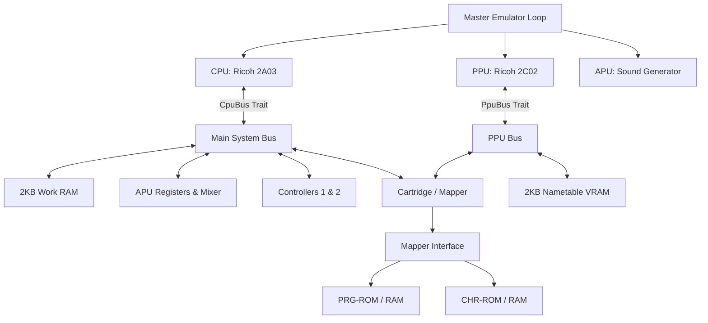
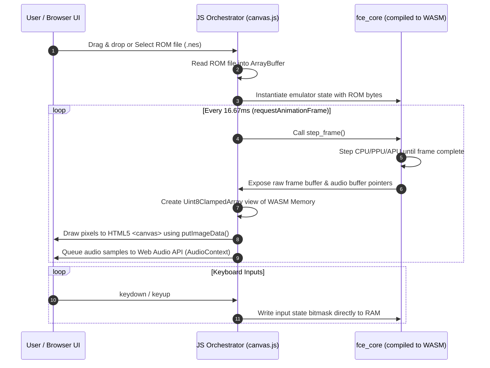

# Famicom (NES) Emulator Design Document: `fce_core`

This document specifies the technical architecture, interface design, timing constraints, and development methodology for a high-performance, highly testable, modular Famicom (NES) emulator written in Rust.

---

## 1. System Architecture Overview

The emulator is designed around **decoupled components** bound together by interface traits. This avoids Rust's common circular ownership pitfalls and enables **Test-Driven Development (TDD)** by allowing each subsystem to be developed and unit-tested independently with mock implementations.

### Headless & Platform Independence Design Goal

Crucially, the core emulator engine (`fce_core`) has **zero system graphics, audio, or windowing dependencies** (such as SDL2, OpenGL, GLFW, or X11/Wayland). The core acts as a pure data transformer: it consumes CPU/PPU clock cycles and controller button states, and writes raw visual pixels to an active RGB24 frame buffer and raw audio samples to a queue.

This enables three distinct running modes:
1. **Headless CLI Testing**: Runs ROMs for a preset number of frames in CLI mode and asserts state or compares frame buffer MD5 checksums. This runs out-of-the-box in headless CI systems and remote SSH environments.
2. **WebAssembly (WASM) Web Client**: The core engine is compiled to WebAssembly (`wasm32-unknown-unknown`) and runs entirely client-side in the browser. JavaScript orchestrates ROM loading, frame ticking (via `requestAnimationFrame`), canvas rendering, and audio playback via the Web Audio API, eliminating the need for active backend servers.
3. **Native Desktop Client** (Optional): A local desktop frontend that mounts the frame buffer using native hardware acceleration (e.g., `pixels` or `sdl2`).

### Component Diagram



### Timing and Synchronization

The NES system is driven by a Master Clock.
- **NTSC Master Clock**: 21.477272 MHz
- **CPU Clock**: Master Clock / 12 (~1.789773 MHz)
- **PPU Clock**: Master Clock / 4 (~5.369318 MHz)
- **Ratio**: Exactly **3 PPU cycles per 1 CPU cycle** for NTSC.

To maintain precise synchronization while preventing performance loss:
1. The emulator runs in a **PPU-driven / Step-by-Step** manner.
2. The master loop steps the CPU by 1 cycle (or runs one instruction and counts its elapsed cycles), and then steps the PPU by `CPU cycles * 3` cycles.
3. NMI (Non-Maskable Interrupt) is generated by the PPU at the start of the vertical blanking interval (VBlank) and signaled to the CPU.

---

## 2. Memory Maps

### 2.1 CPU Memory Map (16-bit / 64KB Address Space)

| Address Range | Size  | Device | Description |
| :--- | :--- | :--- | :--- |
| `0x0000 - 0x07FF` | 2KB | Work RAM | Internal CPU RAM |
| `0x0800 - 0x1FFF` | 6KB | Mirrors | Mirrors of `0x0000 - 0x07FF` (every 0x0800 bytes) |
| `0x2000 - 0x2007` | 8B | PPU Registers | PPU I/O Ports |
| `0x2008 - 0x3FFF` | ~8KB | Mirrors | Mirrors of `0x2000 - 0x2007` (every 8 bytes) |
| `0x4000 - 0x4017` | 24B | APU & I/O | APU channels, Joypads, DMA |
| `0x4018 - 0x401F` | 8B | APU & I/O | Normally disabled APU/IO functionality |
| `0x4020 - 0xFFFF` | ~48KB | Cartridge | PRG ROM, PRG RAM, Mapper registers |

### 2.2 PPU Memory Map (14-bit / 16KB Address Space)

| Address Range | Size | Device | Description |
| :--- | :--- | :--- | :--- |
| `0x0000 - 0x0FFF` | 4KB | Pattern Table 0 | CHR ROM/RAM Bank 0 |
| `0x1000 - 0x1FFF` | 4KB | Pattern Table 1 | CHR ROM/RAM Bank 1 |
| `0x2000 - 0x23FF` | 1KB | Nametable 0 | VRAM / Screen Layout A |
| `0x2400 - 0x27FF` | 1KB | Nametable 1 | VRAM / Screen Layout B |
| `0x2800 - 0x2BFF` | 1KB | Nametable 2 | VRAM / Screen Layout C (usually mirrored) |
| `0x2C00 - 0x2FFF` | 1KB | Nametable 3 | VRAM / Screen Layout D (usually mirrored) |
| `0x3000 - 0x3EFF` | ~3.7KB | Mirrors | Mirrors of `0x2000 - 0x2EFF` |
| `0x3F00 - 0x3F1F` | 32B | Palette RAM | Background & Sprite Palettes |
| `0x3F20 - 0x3FFF` | 224B | Mirrors | Mirrors of `0x3F00 - 0x3F1F` |

---

## 3. Core Interface Design (The Rust Traits)

To facilitate unit testing and decoupled development, the core components communicate through traits.

### 3.1 CPU Bus Interface (`CpuBus`)

The `Cpu` struct does not directly own the system bus. Instead, it accepts any type implementing `CpuBus` during execution.

```rust
pub trait CpuBus {
    /// Reads a byte from the 16-bit address space.
    fn read(&mut self, addr: u16) -> u8;

    /// Writes a byte to the 16-bit address space.
    fn write(&mut self, addr: u16, val: u8);

    /// Polls the state of the CPU interrupt lines.
    /// Returns true if a Non-Maskable Interrupt is pending.
    fn poll_nmi(&mut self) -> bool;

    /// Polls the state of the standard Interrupt Request line.
    fn poll_irq(&self) -> bool;

    /// Clear the NMI flag once serviced.
    fn clear_nmi(&mut self);
}
```

### 3.2 PPU Bus Interface (`PpuBus`)

The PPU interacts with VRAM, Palettes, and Cartridge CHR memory through `PpuBus`.

```rust
pub trait PpuBus {
    /// Reads a byte from PPU 14-bit address space.
    fn read(&mut self, addr: u16) -> u8;

    /// Writes a byte to PPU 14-bit address space.
    fn write(&mut self, addr: u16, val: u8);

    /// Notifies PPU bus of screen mirroring changes.
    fn set_mirroring(&mut self, mode: MirroringMode);
}

#[derive(Debug, Clone, Copy, PartialEq, Eq)]
pub enum MirroringMode {
    Horizontal,
    Vertical,
    SingleScreenLower,
    SingleScreenUpper,
    FourScreen,
}
```

### 3.3 Cartridge & Mapper Interface (`Mapper`)

Mappers translate CPU and PPU addresses into actual offsets inside PRG-ROM/RAM and CHR-ROM/RAM.

```rust
pub trait Mapper {
    /// Map a CPU read address to cartridge memory offset.
    /// Returns `Some(offset)` if handled by mapper, or `None` if unmapped.
    fn map_cpu_read(&self, addr: u16) -> Option<usize>;

    /// Map a CPU write address to cartridge memory offset.
    /// Returns `Some(offset)` if handled by mapper, or `None`.
    /// Can also trigger bank switching or internal mapper configuration.
    fn map_cpu_write(&mut self, addr: u16, val: u8) -> Option<usize>;

    /// Map a PPU read address to cartridge CHR memory offset.
    fn map_ppu_read(&self, addr: u16) -> Option<usize>;

    /// Map a PPU write address to cartridge CHR memory offset.
    fn map_ppu_write(&mut self, addr: u16, val: u8) -> Option<usize>;

    /// Step scanline timing (used by mappers with scanline interrupts, e.g., MMC3).
    fn step_scanline(&mut self) -> bool { false }
}
```

---

## 4. Detailed Component Specifications

### 4.1 CPU Module (Ricoh 2A03)

The CPU is a modified MOS 6502 with no decimal mode and built-in APU and DMA functionality.

#### Execution State

```rust
pub struct Cpu {
    // Registers
    pub a: u8,       // Accumulator
    pub x: u8,       // Index X
    pub y: u8,       // Index Y
    pub pc: u16,     // Program Counter
    pub sp: u8,      // Stack Pointer
    pub status: u8,  // Status Flags

    // Cycle Counting
    pub cycles: u64,
    
    // Interrupt handling helper states
    pub pending_nmi: bool,
    pub pending_irq: bool,
}
```

#### Status Register Flags

```rust
pub struct StatusFlags;
impl StatusFlags {
    pub const CARRY: u8       = 0b0000_0001; // C
    pub const ZERO: u8        = 0b0000_0010; // Z
    pub const INTERRUPT: u8   = 0b0000_0100; // I (Disable IRQ)
    pub const DECIMAL: u8     = 0b0000_1000; // D (Unused in NES, but exists)
    pub const BREAK: u8       = 0b0001_0000; // B (Set when BRK executed)
    pub const BREAK2: u8      = 0b0010_0000; // U (Unused, always 1 on stack)
    pub const OVERFLOW: u8    = 0b0100_0000; // V
    pub const NEGATIVE: u8    = 0b1000_0000; // N
}
```

#### Development & Verification (The Nestest Strategy)
To ensure 100% compliance of instruction execution, addressing modes, and flags, the CPU will be validated using **`nestest.nes`**.
We will write an automated test runner that:
1. Loads the `nestest.nes` ROM.
2. Starts CPU at PC = `0xC000` (the non-interactive automation start vector).
3. Compares CPU state (PC, registers, flags, cycles) line-by-line against the official `nestest.log` output.

### 4.2 PPU Module (Ricoh 2C02)

The PPU generates the video output using a internal 256x240 pixel resolution grid, rendering at 60 fps.

#### Timing and Scanlines

An NTSC frame contains 262 scanlines:
- **Scanline 0 to 239**: Visible frames.
- **Scanline 240**: Post-render scanline (does nothing).
- **Scanline 241 to 260**: Vertical Blanking Interval (VBlank). At the start of scanline 241 (cycle 1), PPU sets the VBlank flag in `PPUSTATUS`. If NMI is enabled in `PPUCTRL`, the CPU is interrupted.
- **Scanline 261**: Pre-render scanline. Resets PPU status flags, loads vertical scroll bits.

#### Low-level PPU Internal Registers (Loopy's Registers)
To correctly implement fine/coarse scrolling during rendering, the PPU must implement the `v`, `t`, `x`, `w` register model:
```rust
pub struct Ppu {
    // Scroll and Address Registers
    pub v: u16, // Current VRAM address (15 bits)
    pub t: u16, // Temporary VRAM address (15 bits)
    pub x: u8,  // Fine X scroll (3 bits)
    pub w: bool,// Write toggle (1 bit)

    // Control and Status Registers
    pub ctrl: u8,   // PPUCTRL
    pub mask: u8,   // PPUMASK
    pub status: u8, // PPUSTATUS
    
    // Data buffering
    pub data_buffer: u8, // Latched data on PPUDATA read
    
    // VRAM / OAM
    pub oam_addr: u8,
    pub oam_data: [u8; 256], // Sprite memory
    pub palette_ram: [u8; 32],

    // Internal Pipeline Counters
    pub scanline: i16,
    pub cycle: i16,
    
    // Output Frame Buffer (256 x 240 pixels, RGB format)
    pub frame_buffer: Box<[u8; 256 * 240 * 3]>,
}
```

### 4.3 APU Module (Audio Processing Unit)

The APU synthesizes 5 audio channels:
- **Pulse 1 & 2**: Square waves with volume envelopes, sweep units, and duty cycle selections.
- **Triangle**: Smooth triangle wave, 4-bit volume (driven by linear counter).
- **Noise**: 1-bit pseudo-random noise with periodic length/frequency control.
- **DMC**: Delta Modulation Channel for PCM audio playback (DMA reads from PRG RAM).

APU updates are driven by a **Frame Counter** running at ~240Hz, which triggers envelope/linear counter clocks, length counter/sweep clocks, and optional IRQs.

### 4.4 Cartridge & Mappers

The `Cartridge` parses the file header and creates the corresponding `Mapper` implementation.

```rust
pub struct Cartridge {
    pub prg_rom: Vec<u8>,
    pub chr_rom: Vec<u8>,
    pub prg_ram: Vec<u8>,
    pub chr_ram: Vec<u8>,
    pub mapper_id: u8,
    pub mirroring: MirroringMode,
    pub has_battery: bool,
}
```

We will target four of the most common mappers first to cover 95% of popular games:
1. **Mapper 0 (NROM)**: Static mapping. 16KB/32KB PRG ROM, 8KB CHR ROM. (Super Mario Bros, Donkey Kong).
2. **Mapper 1 (MMC1)**: Serial write register shifting. Bank-switched PRG & CHR ROMs, dynamic mirroring configuration. (The Legend of Zelda, Metroid).
3. **Mapper 2 (UxROM)**: Simple banking. Fixed upper 16KB PRG ROM, bank-switched lower 16KB PRG ROM. (Mega Man, Castlevania).
4. **Mapper 3 (CNROM)**: CHR Bank switching. Static PRG ROM, switchable CHR banks. (Duck Hunt).

---

## 5. Development Strategy and Parallelization Plan

To maximize efficiency and enable multiple team members to work concurrently without conflicts, the development is divided into highly isolated tracks with mock borders.

### Module Organization

```text
src/
├── core/               # Pure Headless Core Library (fce_core)
│   ├── mod.rs          # Master timing and loop coordinator
│   ├── bus.rs          # Core Bus coordinating memory map
│   ├── cpu/
│   │   ├── mod.rs      # CPU registers, execution loops
│   │   ├── opcodes.rs  # 6502 Instruction matrix
│   │   └── tests.rs    # Nestest runner and micro-benchmarks
│   ├── ppu/
│   │   ├── mod.rs      # PPU interface and registers
│   │   ├── registers.rs# Scroll, v, t registers (loopy)
│   │   └── render.rs   # Scanline rendering pipeline
│   ├── apu/
│   │   ├── mod.rs      # APU coordinator
│   │   └── channels.rs # Pulse, Triangle, Noise, DMC generators
│   └── controller.rs   # Joypad shift-register state machine
│
└── bin/                # Frontend Executables
    ├── desktop.rs      # Local native desktop visual client (SDL2/pixels)
    └── headless.rs     # Headless test CLI runner (MD5 frame-matching)
```

### Team Roles & Work Packages

| Developer | Primary Focus | Deliverables |
| :--- | :--- | :--- |
| **Developer A** | CPU Core & Bus Coordination | Fully passing `nestest.nes` log match, complete `CpuBus` integration, Joypad implementation. |
| **Developer B** | PPU Rendering Engine | Cycle-by-cycle PPU scanning, OAM, scroll management (loopy registers), frame buffer output. |
| **Developer C** | Cartridge Loader & Mappers | iNES parser, Mapper 0, Mapper 1, Mapper 2, and Mapper 3 implementations. |
| **Developer D** | APU & WASM Frontend | APU synthesis, WASM bindings, client-side HTML5 Canvas rendering. |

### Test-Driven Integration Points
- **Point 1 (CPU + Mappers)**: Developer A and C merge. Run CPU instructions directly out of Mapper 0 ROM mapping.
- **Point 2 (Nestest Passing)**: CPU verifies all operations via automated comparison of execution logs.
- **Point 3 (Static Render)**: Developer B runs PPU on static CHR maps provided by Developer C. PPU renders standard static Nametable buffers without CPU cycles.
- **Point 4 (Full Loop)**: Combine CPU + PPU running at 1:3 cycles. Verify with standard test ROMs (`vbl_nmi_timing`, `sprite_hit_tests`).

---

## 6. Rust Code Quality and Standards

1. **Safety**: Keep code safe. Avoid `unsafe` unless doing extremely performance-critical operations (e.g. frame-buffer array copying), and document any `unsafe` blocks with a `// SAFETY:` comment.
2. **Performance**:
   - Use stack arrays or `Box<[u8]>` for fixed-size buffers instead of `Vec<u8>` to minimize dynamic allocation during loops.
   - Inline warm execution paths (`#[inline]`) for instruction fetching, mapping, and memory read/writes.
3. **Clarity**:
   - Leverage Rust's strongly typed enums for CPU instruction categories and PPU phases.
   - Avoid "magic numbers" — declare well-documented constants for addresses, masks, and timing frequencies.
4. **Idiomatic Rust**:
   - Use `impl CpuBus` and generic constraints instead of expensive runtime dynamic dispatch (`Box<dyn CpuBus>`) where possible.
   - Use `std::num::Wrapping` or wrapping math operators (`wrapping_add`, `wrapping_sub`) to make stack overflow and arithmetic wrap behavior explicit and performant.

---

## 7. WebAssembly (WASM) Client-Side Architecture

To achieve zero-cost scaling, native-level playability, and flawless audio-visual synchronization, the web platform interface is compiled to WebAssembly (`wasm32-unknown-unknown`). The emulator runs entirely inside the client browser's sandbox.



### 7.1 The WASM Binding Layer (`fce_wasm`)
* **Rust WASM Bindings**: A wrapper module compiles `fce_core` to target WASM using `wasm-bindgen`.
* **Shared Memory Strategy (Zero-Copy)**:
  Rather than copying the 184KB visual frame buffer (`256 * 240 * 3` bytes) from WASM to JS every frame, the JavaScript frontend directly reads from the Rust WASM linear memory.
  * Expose the raw pointer to the frame buffer:
    ```rust
    #[wasm_bindgen]
    pub fn get_frame_buffer_ptr(emu: &Emulator) -> *const u8 {
        emu.bus.ppu.frame_buffer.as_ptr()
    }
    ```
  * In JavaScript, create a view directly onto this pointer:
    ```javascript
    const ptr = wasm.get_frame_buffer_ptr(emu);
    const bufferView = new Uint8Array(wasm.memory.buffer, ptr, 256 * 240 * 3);
    ```
  This eliminates serialization and copying overhead, enabling near-zero CPU usage in JS.

### 7.2 Audio Pipeline via Web Audio API
* **Dynamic Sampling**: The browser's `AudioContext` pulls float audio samples directly from the emulator's APU queue.
* **Jitter-free Scheduling**: The JS orchestrator reads the variable sample buffer length generated during the visual frame step and schedules it dynamically using `audioCtx.createBuffer` and `source.start(nextStartTime)`, keeping `nextStartTime` locked to real-time to prevent compounding drift.

### 7.3 Sizing, Slices & Assets Distribution
* **Zero Backend Footprint**: The application is distributed as static files (HTML, CSS, JS, and the `.wasm` binary). It can be hosted entirely on a standard static CDN (e.g., Cloudflare Pages, Firebase Hosting) for near-infinite scale at zero active running cost.
* **IndexedDB Persistence**: Game save states (SRAM for games with battery-backed RAM like Zelda) are saved locally in the browser's `IndexedDB` container, ensuring player persistence without server databases.

