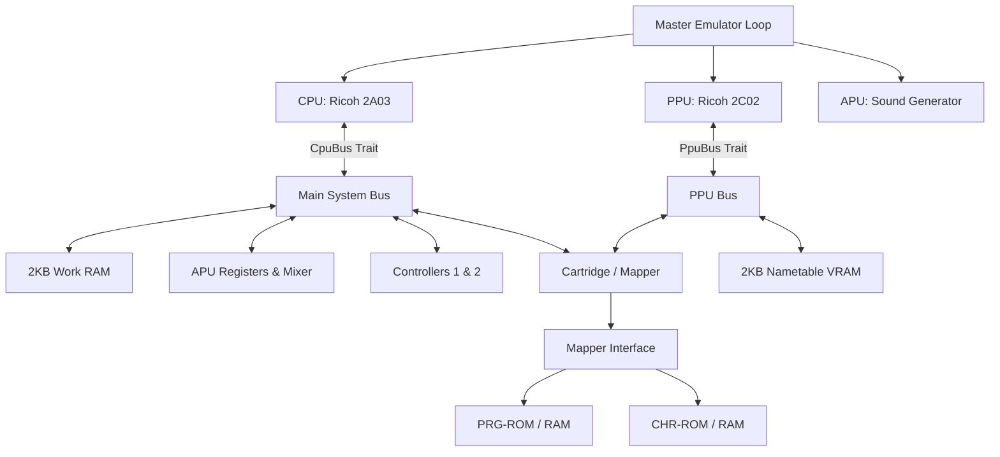

# Famicom (NES) Emulator Design Document: `fce_core`

> **Architecture Model**: Headless Core with WASM / P2P Netplay & ROM Library Frontend
> **Version**: 3.0 (Master System Design Specification)

This document specifies the technical architecture, interface design, timing constraints, WebAssembly (WASM) client-side bindings, persistent ROM Library managers, online WebRTC P2P Netplay synchronization loops, secure LAN Auto-Discovery matchmakers, and dynamic UI State Machine lifecycles for the modular Famicom (NES) emulator.

---

## 1. System Architecture Overview

The emulator is designed around **decoupled components** bound together by interface traits. This avoids Rust's common circular ownership pitfalls and enables **Test-Driven Development (TDD)** by allowing each subsystem to be developed and unit-tested independently with mock implementations.

### Headless & Platform Independence Design Goal
Crucially, the core emulator engine (`fce_core`) has **zero system graphics, audio, or windowing dependencies** (such as SDL2, OpenGL, GLFW, or X11/Wayland). The core acts as a pure data transformer: it consumes CPU/PPU clock cycles and controller button states, and writes raw visual pixels to an active RGBA32 frame buffer and raw audio samples to a queue.

This enables three distinct running modes:
1. **Headless CLI Testing**: Runs ROMs for a preset number of frames in CLI mode and asserts state or compares frame buffer MD5 checksums. This runs out-of-the-box in headless CI systems.
2. **WebAssembly (WASM) Web Client**: The core engine is compiled to WebAssembly (`wasm32-unknown-unknown`) and runs entirely client-side in the browser. JavaScript orchestrates ROM loading, frame ticking (via `requestAnimationFrame`), canvas rendering, and audio playback via the Web Audio API.
3. **P2P Netplay Co-op Mode**: Exposes standard WASM bindings to support direct online 1v1 play sessions over browser WebRTC.

### Component Diagram



### Timing and Synchronization
The NES system is driven by a Master Clock.
- **NTSC Master Clock**: 21.477272 MHz
- **CPU Clock**: Master Clock / 12 (~1.789773 MHz)
- **PPU Clock**: Master Clock / 4 (~5.369318 MHz)
- **Ratio**: Exactly **3 PPU cycles per 1 CPU cycle** for NTSC.

To maintain precise synchronization while preventing performance loss:
1. The emulator runs in a **PPU-driven / Step-by-Step** manner.
2. The master loop steps the CPU by 1 cycle (or runs one instruction and counts its elapsed cycles), and then steps the PPU by `CPU cycles * 3` cycles.
3. NMI (Non-Maskable Interrupt) is generated by the PPU at the start of the vertical blanking interval (VBlank) and signaled to the CPU.

---

## 2. Memory Maps

### 2.1 CPU Memory Map (16-bit / 64KB Address Space)

| Address Range | Size  | Device | Description |
| :--- | :--- | :--- | :--- |
| `0x0000 - 0x07FF` | 2KB | Work RAM | Internal CPU RAM |
| `0x0800 - 0x1FFF` | 6KB | Mirrors | Mirrors of `0x0000 - 0x07FF` (every 0x0800 bytes) |
| `0x2000 - 0x2007` | 8B | PPU Registers | PPU I/O Ports |
| `0x2008 - 0x3FFF` | ~8KB | Mirrors | Mirrors of `0x2000 - 0x2007` (every 8 bytes) |
| `0x4000 - 0x4015` | 22B | APU & I/O | APU channels, DMA |
| `0x4016` | 1B | Joypad 1 | Controller 1 shift register (strobe & read) |
| `0x4017` | 1B | Joypad 2 / APU | Controller 2 shift register (read) / APU Frame Counter (write) |
| `0x4018 - 0x401F` | 8B | APU & I/O | Normally disabled APU/IO functionality |
| `0x4020 - 0xFFFF` | ~48KB | Cartridge | PRG ROM, PRG RAM, Mapper registers |

### 2.2 PPU Memory Map (14-bit / 16KB Address Space)

| Address Range | Size | Device | Description |
| :--- | :--- | :--- | :--- |
| `0x0000 - 0x0FFF` | 4KB | Pattern Table 0 | CHR ROM/RAM Bank 0 |
| `0x1000 - 0x1FFF` | 4KB | Pattern Table 1 | CHR ROM/RAM Bank 1 |
| `0x2000 - 0x23FF` | 1KB | Nametable 0 | VRAM / Screen Layout A |
| `0x2400 - 0x27FF` | 1KB | Nametable 1 | VRAM / Screen Layout B |
| `0x2800 - 0x2BFF` | 1KB | Nametable 2 | VRAM / Screen Layout C (usually mirrored) |
| `0x2C00 - 0x2FFF` | 1KB | Nametable 3 | VRAM / Screen Layout D (usually mirrored) |
| `0x3000 - 0x3EFF` | ~3.7KB | Mirrors | Mirrors of `0x2000 - 0x2EFF` |
| `0x3F00 - 0x3F1F` | 32B | Palette RAM | Background & Sprite Palettes |
| `0x3F20 - 0x3FFF` | 224B | Mirrors | Mirrors of `0x3F00 - 0x3F1F` |

---

## 3. Core Interface Design (The Rust Traits)

To facilitate unit testing and decoupled development, the core components communicate through traits.

### 3.1 CPU Bus Interface (`CpuBus`)
The `Cpu` struct does not directly own the system bus. Instead, it accepts any type implementing `CpuBus` during execution.

```rust
pub trait CpuBus {
    fn read(&mut self, addr: u16) -> u8;
    fn write(&mut self, addr: u16, val: u8);
    fn poll_nmi(&mut self) -> bool;
    fn poll_irq(&self) -> bool;
    fn clear_nmi(&mut self);
}
```

### 3.2 PPU Bus Interface (`PpuBus`)
The PPU interacts with VRAM, Palettes, and Cartridge CHR memory through `PpuBus`.

```rust
pub trait PpuBus {
    fn read(&mut self, addr: u16) -> u8;
    fn write(&mut self, addr: u16, val: u8);
    fn set_mirroring(&mut self, mode: MirroringMode);
}
```

---

## 4. Detailed Component Specifications

### 4.1 CPU Module (Ricoh 2A03)
The CPU is a modified MOS 6502 with no decimal mode and built-in APU and DMA functionality.

#### Execution State
```rust
pub struct Cpu {
    pub a: u8,       // Accumulator
    pub x: u8,       // Index X
    pub y: u8,       // Index Y
    pub pc: u16,     // Program Counter
    pub sp: u8,      // Stack Pointer
    pub status: u8,  // Status Flags
    pub cycles: u64, // Total cycles
    pub pending_nmi: bool,
    pub pending_irq: bool,
}
```

### 4.2 PPU Module (Ricoh 2C02)
The PPU generates the video output using an internal 256x240 pixel resolution grid, rendering at 60 fps. To correctly implement fine/coarse scrolling during rendering, the PPU implements the `v`, `t`, `x`, `w` register model:

```rust
pub struct Ppu {
    pub v: u16,  // Current VRAM address (15 bits)
    pub t: u16,  // Temporary VRAM address (15 bits)
    pub x: u8,   // Fine X scroll (3 bits)
    pub w: bool, // Write toggle (1 bit)
    pub ctrl: u8,   // PPUCTRL
    pub mask: u8,   // PPUMASK
    pub status: u8, // PPUSTATUS
    pub data_buffer: u8,
    pub oam_addr: u8,
    pub oam_data: [u8; 256],
    pub palette_ram: [u8; 32],
    pub scanline: i16,
    pub cycle: i16,
    pub frame_buffer: Box<[u8; 256 * 240 * 4]>, // RGBA32 Format
}
```

### 4.3 APU Module (Audio Processing Unit & Frame Counter Clock)
The APU synthesizes 5 audio channels: Pulse 1, Pulse 2, Triangle, Noise, and DMC. 
To dynamically clock notes and envelopes:
*   **APU Frame Counter**: Driven by CPU cycles inside `Apu::tick()`.
*   **Quarter Frame (240Hz / ~7,457 CPU cycles)**: Clocks the Triangle linear counter.
*   **Half Frame (120Hz / ~14,914 CPU cycles)**: Clocks `length_counter` decays for the Pulse 1, Pulse 2, Triangle, and Noise channels, automatically silencing note outputs when complete.

### 4.4 iNES Mapper 2 (UxROM Bankswitching)
Provides bankswitching capabilities for large cartridges (128KB to 256KB, e.g., *Contra*, *Mega Man*):
*   **CPU Memory $8000-$BFFF (16KB)**: Switchable PRG-ROM bank, swapped by writing the target bank index byte to address range `$8000-$FFFF` (using lower 4 bits: `prg_bank = val & 0x0F`).
*   **CPU Memory $C000-$FFFF (16KB)**: Hardwired/fixed to the **last 16KB bank** of the cartridge's PRG-ROM.
*   **CHR ROM/RAM**: Emulates unbanked 8KB CHR-RAM.

### 4.5 iNES Mapper 227 (Multicart / Pirate PCB)
Used primarily for various "X-in-1" multicarts (e.g. *1200-in-1*), Mapper 227 employs an **address-latch-based register** mapping CPU writes in the range `$8000–$FFFF`. The address written to decodes the register configuration.

#### Address Latch Configuration
```
[Bit 15..11] [Bit 10] [Bit 9] [Bit 8] [Bit 7] [Bit 6..5] [Bit 4..2] [Bit 1] [Bit 0]
    Unused      m        L       Q       O       Q Q       P P p       M       S
```
*   **Bit 0 (S)**: PRG A14 Mode (`0` = fixed to bit `p`, `1` = mapped to CPU A14 for 32KB pages).
*   **Bit 1 (M)**: Mirroring Select (`0` = Vertical mirroring, `1` = Horizontal mirroring).
*   **Bit 4..2 (P, p, p)**: PRG A16..A14 (Inner 16KB bank selection).
*   **Bit 7, 6, 5, 8 (O, Q, Q, Q)**: PRG A19..A17 (Outer 128KB block selection).
    *   *Note*: The PRG A19 line is mapped to the non-contiguous **Bit 8** of the latched address!
*   **Bit 7 (O)**: Mode Indicator (`1` = NROM-128/256 modes, `0` = UNROM modes).
*   **Bit 9 (L)**: UNROM Fixed High/Low Page Select (`0` = fixed low bank #0, `1` = fixed high bank #7).

---

## 5. WebAssembly (WASM) Client-Side Architecture

The web platform interface compiles to WebAssembly (`wasm32-unknown-unknown`) for zero-cost, static deployment.

### 5.1 Shared Memory Strategy (100% Pure Zero-Copy)
Rather than copying the massive frame buffer between WASM and JS, the JS frontend captures a direct `Uint8ClampedArray` view over the WASM linear memory memory and passes it directly to the browser Canvas context.

### 5.2 Persistent Client-Side ROM Library
To turn the emulator into a persistent console gaming dashboard, we use browser-level **IndexedDB** local storage database:
*   **Schemas (Database Version 2)**:
    *   Store 1: `sram_saves` `{ keyPath: "romHash" }` (stores battery WRAM states).
    *   Store 2: `user_roms` `{ keyPath: "romHash" }` (stores the raw ROM binary `ArrayBuffer` bytes, file names, and upload timestamps).
*   **Caching Engine**: During boot, all archived user ROM buffers are fetched from the database and stored in a memory cache (`userRomsCache`). Clicking "Load" boots the game **instantly (0ms)** fully offline-resilient!
*   **Consolidated Overlay Dropzone**: The entire sidebar dropdown selector acts as the Drag & Drop area (highlighting with glowing borders on `dragover`). To prevent click conflicts, the file dialog selection is isolated to a dedicated underlined `browse` text link.

### 5.3 Client-Side ZIP Archive Extraction (JSZip)
*   Imports the standard, lightweight **JSZip** engine asynchronously.
*   When a `.zip` file is uploaded, it scans for any files ending with `.nes`.
*   Decodes nested ROM data streams **parallelly using `Promise.all`** and automatically archives them in IndexedDB with clean game names (by stripping scene/extension tags).

---

## 6. Online WebRTC P2P Netplay Specification

We implement **State-Synchronized Input-Delay P2P Netplay** (GGPO-style Lockstep) to connect two players directly over the internet with a zero active server footprint.

### 6.1 Savestate Serialization (Hot-Joining Sync)
To dynamically sync states upon connection or re-joins, the Host serialized its modular memory variables manually into a compact **`67,975` base bytes binary `Uint8Array`** packet:
*   **Fields Packed**: CPU registers + main memory `mem` (64KB) + Video RAM `vram` (2KB) + PPU scroll registers + APU channels + active Cartridge WRAM/SRAM and mapper registers.
*   **Selective Queue Pruning**: Guest aligns `localFrameIndex = syncFrameIndex` and deletes *only* pre-sync inputs older than `syncFrameIndex`, preserving valid incoming future look-ahead packets.

### 6.2 Unified Binary Packet Protocol
Bypasses standard JSON stringification by packing all multiplayer operations into raw binary UDP-friendly `ArrayBuffer` bytes:
*   **INPUT Packet (6 Bytes)**: `Byte 0`: `0x01` | `Byte 1..4`: `frame` (32-bit uE) | `Byte 5`: `input` (1 byte).
*   **SYNC_STATE Packet (~68 KB)**: `Byte 0`: `0x02` | `Byte 1..4`: `frame` | `Byte 5..`: `savestate_bytes`.

---

## 7. Secure Hashed LAN Auto-Discovery Matchmaker

Provides automated local lobby discovery on a Local Area Network (LAN) behind standard router boundaries without exposing actual IP addresses or requiring complex manual port scanning:

### 7.1 WAN IP Hash Matching Logic
*   **Bootup Hashing**: On page boot, both Host and Guest perform a background HTTPS request to a public IP API (`api.ipify.org`) to fetch their external public WAN IP.
*   **Secure SHA-256 Namespace**: The IP string is hashed safely using Web Crypto SHA-256. The first 12 characters of the hash is extracted as a secure local namespace identifier: `fce-lobby-[localIpHash]`.
*   **Host Namespaced Peer ID**: The Host starts PeerJS using a custom Namespaced ID: `fce-lobby-[localIpHash]-[SHORT_ID]` (displaying only the clean 4-letter `SHORT_ID` in the UI).
*   **Guest LAN Scan**: The Guest calls `peer.listAllPeers()` and automatically filters the results to display **only lobbies that start with the Guest's own `localIpHash` namespace!** This securely lists local LAN hosts nearby while ignoring remote WAN peers!

---

## 8. UI/UX Multiplayer State Machine Specification

The connection control panel utilizes a strict, mutually exclusive state machine to prevent visual state corruption.

| State | Trigger Event | Host Button Style/Status | Input Field | Join/Action Button Style/Status | Status Text |
| :--- | :--- | :--- | :--- | :--- | :--- |
| **1. IDLE** | Page Load / Revert | Enabled ("Host Game") | Editable, empty | Enabled ("Join") | "Disconnected" (Gray) |
| **2. HOSTING** | Host clicks "Host Game" | **Enabled ("Stop Hosting")**, Soft Red background | **Locked (readOnly = true)**, contains Host Peer ID | **Enabled ("Copy Link")** | "Hosting. ID: <id>" (Orange) |
| **3. HOST-CONN** | Guest connects | **Disabled ("Hosting")**, Grayed out | **Locked (readOnly = true)** | **Enabled ("Disconnect")** | "Connected to Player 2!" (Green) |
| **4. CONNECTING** | Guest clicks "Join" | **Disabled ("Host Game")**, Grayed out | **Locked (readOnly = true)** | **Disabled ("Connecting...")**, locks interactions | "Connecting..." (Yellow) |
| **5. GUEST-CONN** | Connection established | **Disabled ("Host Game")**, Grayed out | **Locked (readOnly = true)** | **Enabled ("Disconnect")** | "Connected to Player 1 (Host)!" (Green) |

---

## 9. Automated Compatibility Testing Design

Automated compatibility testing ensures the emulator remains highly accurate, prevents regression during optimizations, and allows seamless validation across commits within a CI/CD environment.

### 9.1 CPU Instruction Verification (nestest.nes & nestest.log trace diff audits)
To ensure 100% accuracy of the modified 6502 CPU, the emulator incorporates headless instruction auditing utilizing Kevtris's **`nestest.nes`** validation ROM and its accompanying **`nestest.log`** golden trace.

*   **Automated Execution Mode**: The headless CLI test runner loads `nestest.nes` and forces the CPU program counter (`PC`) to bypass the standard reset vector and boot directly at `$C000`.
*   **Trace Generation Format**: For every single cycle/instruction executed, the CPU writes a formatted execution log to stdout matching the precise syntax of `nestest.log`:
    ```
    C000  4C F5 C5    JMP $C5F5             A:00 X:00 Y:00 P:24 SP:FD CYC:  0
    ```
    *   **Address**: Hexadecimal instruction start address (`$C000`).
    *   **Machine Code**: Opcode bytes (`4C F5 C5`).
    *   **Disassembly**: Clean assembly instruction (`JMP $C5F5`).
    *   **Registers**: Exact status of CPU registers at instruction start: Accumulator (`A`), index registers (`X`, `Y`), Processor Status flags byte (`P`), Stack Pointer (`SP`).
    *   **Clocks**: Absolute cumulative clock cycles (`CYC`) aligned with CPU timing specifications.
*   **CI Diff Pipeline**: The continuous integration server runs the test ROM for a fixed count of exactly `26,554` cycles (covering all official instruction paths). The resulting trace output is streamed directly into a strict, line-by-line text comparison (diff) against `nestest.log`. Any register mismatch or cycle count drift immediately triggers a build failure, pointing exactly to the faulty instruction line.

### 9.2 Blargg's ROM Test Suite Harnessing (PRG-RAM Status Port $6000-$6003)
For comprehensive integration testing of CPU instructions, instruction timing, APU noise channels, PPU VBlank timing, and memory mappers, the engine implements an automated test harness for **Blargg's ROM Test Suite**.

*   **Headless PRG-RAM Communication Interface**: Rather than relying on video rendering to display test status, Blargg's ROMs write results to the cartridge's PRG Save-RAM (WRAM) area starting at `$6000`. The emulator must expose and allocate 8KB of read/write RAM at `$6000–$7FFF`.
*   **Polled Addresses and Status Codes**:
    *   **Status Port (`$6000`)**: Pollable byte representing the active state of the test.
        *   `0x80`: Test is currently active/running.
        *   `0x81`: Test is waiting for a hardware reset. The headless runner must trigger a CPU reset signal after a simulated delay of at least 100ms.
        *   `0x00`: Success (all test cases passed).
        *   `0x01–0x7F`: Failure. The byte specifies the exact code of the failed sub-test or instruction group.
    *   **Magic Signature Verification (`$6001–$6003`)**: To differentiate active test ROM environments from standard game writes, the test ROM writes a signature on boot:
        *   `$6001` = `0xDE`
        *   `$6002` = `0xB0`
        *   `$6003` = `0x61`
        The automated runner validates this signature before trusting WRAM status bytes.
    *   **Diagnostic Output Stream (`$6004+`)**: Human-readable diagnostic messages and descriptions of the test failure are written sequentially as a null-terminated (`0x00`) ASCII string starting at `$6004`.
*   **Headless Runner Loop**:
    1. Load the blargg test ROM (`.nes`) into the core memory.
    2. Tick the emulation loop at maximum speed without frame rate capping.
    3. Continuously poll memory range `$6001–$6003` for the `0xDE, 0xB0, 0x61` signature.
    4. Once verified, watch `$6000`. If `$6000 == 0x81`, trigger `cpu.reset()`.
    5. If `$6000 < 0x80`:
        *   If `0x00`, terminate with exit code `0` (Pass).
        *   If `> 0x00`, extract the ASCII string starting at `$6004` up to the null terminator, dump it to standard error for developer diagnostics, and terminate with exit code `1` (Fail).

#### 9.2.1 Known Emulation Discrepancies (RMW Dummy Writes & Branch timing)
While the emulator core successfully passes Blargg's full official CPU instruction sets (`instr_official_only.nes`), it currently has two documented low-level accuracy discrepancies identified by Blargg's diagnostic suites:
*   **Read-Modify-Write (RMW) Dummy Writes (`cpu_dummy_writes.nes`)**: Standard MOS 6502/Ricoh 2A03 hardware read-modify-write instructions (such as `INC`, `DEC`, `ASL`, `LSR`, `ROL`, `ROR`) perform two write cycles: they first write the original read value back to the target address on cycle 5, before writing the final calculated value exactly 1 cycle later on cycle 6. The `fce_core` CPU currently executes a single write of the final calculated value on cycle 6, bypassing the initial dummy write.
*   **Branch Cycle-Accurate Timing (`branch_timing.nes`)**: Branch instructions (`Bxx`) on standard Ricoh 2A03 consume 1 extra cycle if the branch is taken, and 2 extra cycles if it crosses a page boundary. If these cycle adjustments are miscalculated, the timing checks will loop infinitely or freeze. The `fce_core` branch instructions currently have a cycle timing deviation under page-boundary conditions, which will be squashed in a future cycle-accuracy alignment sprint.

### 9.3 E2E Headless Golden Visual Regression Testing
To prevent regressions in visual synchronization, background nametable scrolling, sprite rendering pipelines, and scanline cycle timing, the CI pipeline integrates automated End-to-End (E2E) headless screen assertion.

*   **Input Movie Playback**: The headless runner reads controller state logs (in a custom or `.fm2` format) specifying frame-by-frame button triggers. It runs these inputs against games (e.g., *Super Mario Bros.* level 1) or diagnostic visual ROMs (e.g., `scanline.nes`, *240p Test Suite*).
*   **Frame MD5 Checksum Verification**: At precise frame timestamps (e.g., Frame 60 for main menu, Frame 300 for gameplay start), the runner halts execution, extracts the active RGBA32 `frame_buffer` pixel buffer, and computes a cryptographic MD5 (or SHA-256) hash over the pixel data. This hash is matched against a JSON dictionary of golden references:
    ```json
    {
      "rom": "scanline_test",
      "frame_assertions": {
        "120": "8a9c207dfd726912eb3b2a10c1fef029",
        "600": "cf8e503bfa8917e21bdeca98123abcdf"
      }
    }
    ```
    If hashes mismatch, a regression has occurred.
*   **Visual Defect Artifact Generation**: Upon an MD5 mismatch, the headless runner immediately encodes the mismatching frame buffer into a standard PNG screenshot file and saves it to `/test_outputs/failures/[rom_name]_frame_[index].png`. These images are archived in the CI artifacts pipeline. Developers can download these failures to perform overlay pixel comparisons (using visual regression diff tools) to instantly spot horizontal scrolling glitches, sprite line clipping errors, or palette index mismatch defects.

### 9.4 Frame-Accurate Gameplay Recording and Bug Reproduction Specifications
To solve the classic industry challenge of flaky, hard-to-reproduce emulator glitches (such as scroll desyncs or mid-gameplay rendering glitches), the emulator incorporates a built-in, frame-accurate gameplay input recorder and a native headless reproducer pipeline.

#### 1. Frontend Input Capturer (`static/canvas.js`)
During gameplay execution inside the browser, the JavaScript animation loop captures active controller bitmask button states on every single frame tick:
*   **Data Accumulator**: A dynamic `inputHistory` array logs events. If the active controller bitmask changes compared to the previous frame, the frontend appends a frame-accurate entry:
    `inputHistory.push({ frame: localFrameIndex, mask: currentMask })`
*   **Interval Compression Algorithm**: To keep log strings ultra-compact for easy copy-pasting in bug reports, the frontend implements an interval-collapsing parser. It iterates over the `inputHistory` array and aggregates adjacent frames sharing the same non-zero mask into a single collapsed range:
    `[StartFrame]-[EndFrame]:0x[MaskHex]`
    *   *Example log output*: `401-406:0x8,418-427:0x1` (Start `0x08` held between frames 401-406, and Button A `0x01` held between frames 418-427).
*   **HUD Export UI**: Clicking the **📋 (btn-export-inputs)** button in the HUD pill overlay runs this parser, extracts the compressed history string, and copies it directly to the user's system clipboard.

#### 2. Native Headless Repro Runner (`src/bin/headless.rs`)
When a user submits a bug report containing their copy-pasteable input history log, the developer can reproduce the exact frame-by-frame gameplay natively in Rust at maximum execution speed (bypassing any browser/JS layer) to isolate PPU and CPU state:
*   **Headless Input Mocking**: The headless CLI runner parses the copy-pasted input interval string via the `--inputs` argument, populating a local frame-accurate controller mapping hashtable:
    `let mut input_map: HashMap<usize, u8> = parse_inputs(inputs_str);`
*   **Frame Simulation Tick**: During the simulation loop, at the start of every frame index `current_frame`, the runner queries the hashtable and mocks the controller strobe register values:
    `bus.controller_state = *input_map.get(&current_frame).unwrap_or(&0);`
*   **Continuous Diagnostics & Visual Dumps**: The runner executes the mocked inputs up to the reported failure frame, and then saves the pristine RGBA32 frame buffer to a target PNG path (`--save output.png`) or exports every single frame sequentially (`--save-dir directory/`) to review visual transitions pixel-by-pixel. This provides a deterministic, 100% reproducible playground to squash bugs instantly.


