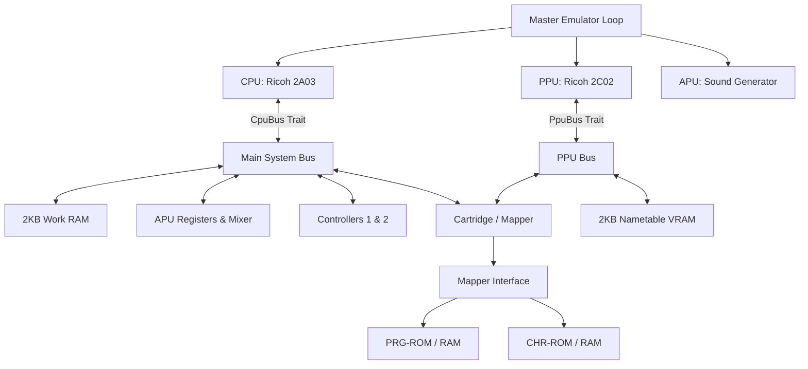
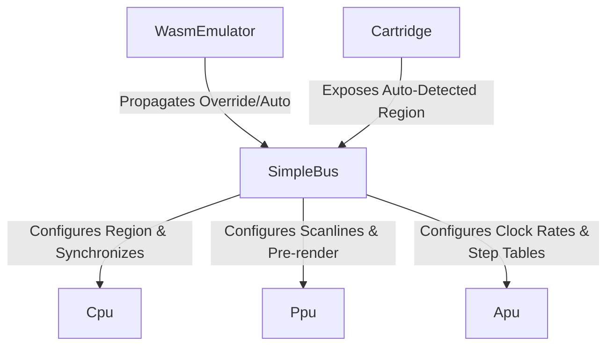
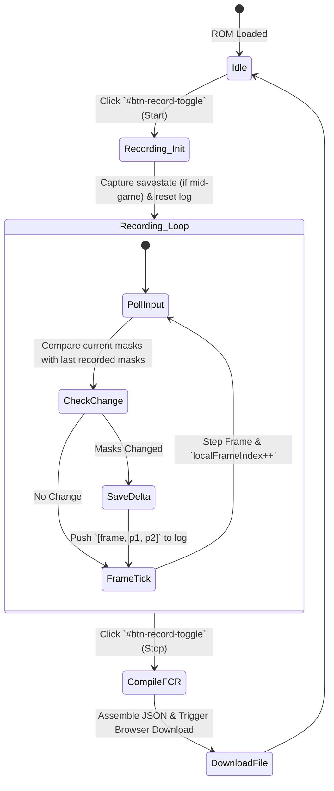
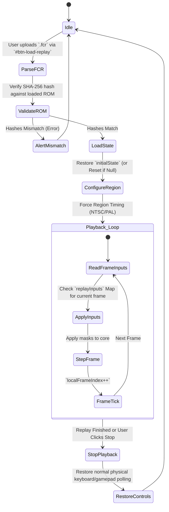
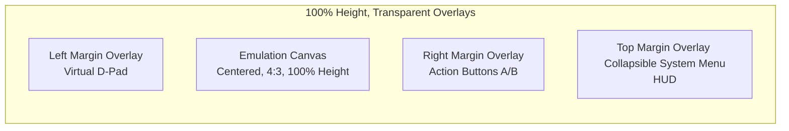

# Famicom (NES) Emulator Design Document: `fce_core`

> **Architecture Model**: Headless Core with WASM / P2P Netplay & ROM Library Frontend
> **Version**: 3.0 (Master System Design Specification)

This document specifies the technical architecture, interface design, timing constraints, WebAssembly (WASM) client-side bindings, persistent ROM Library managers, online WebRTC P2P Netplay synchronization loops, secure LAN Auto-Discovery matchmakers, and dynamic UI State Machine lifecycles for the modular Famicom (NES) emulator.

---

## 1. System Architecture Overview

The emulator is designed around **decoupled components** bound together by interface traits. This avoids Rust's common circular ownership pitfalls and enables **Test-Driven Development (TDD)** by allowing each subsystem to be developed and unit-tested independently with mock implementations.

### Headless & Platform Independence Design Goal
Crucially, the core emulator engine (`fce_core`) has **zero system graphics, audio, or windowing dependencies** (such as SDL2, OpenGL, GLFW, or X11/Wayland). The core acts as a pure data transformer: it consumes CPU/PPU clock cycles and controller button states, and writes raw visual pixels to an active RGBA32 frame buffer and raw audio samples to a queue.

This enables three distinct running modes:
1. **Headless CLI Testing**: Runs ROMs for a preset number of frames in CLI mode and asserts state or compares frame buffer MD5 checksums. This runs out-of-the-box in headless CI systems.
2. **WebAssembly (WASM) Web Client**: The core engine is compiled to WebAssembly (`wasm32-unknown-unknown`) and runs entirely client-side in the browser. JavaScript orchestrates ROM loading, frame ticking (via `requestAnimationFrame`), canvas rendering, and audio playback via the Web Audio API.
3. **P2P Netplay Co-op Mode**: Exposes standard WASM bindings to support direct online 1v1 play sessions over browser WebRTC.

### Component Diagram



### Timing and Synchronization
The NES system is driven by a Master Clock.
- **NTSC Master Clock**: 21.477272 MHz
- **CPU Clock**: Master Clock / 12 (~1.789773 MHz)
- **PPU Clock**: Master Clock / 4 (~5.369318 MHz)
- **Ratio**: Exactly **3 PPU cycles per 1 CPU cycle** for NTSC.

To maintain precise synchronization while preventing performance loss:
1. The emulator runs in a **PPU-driven / Step-by-Step** manner.
2. The master loop steps the CPU by 1 cycle (or runs one instruction and counts its elapsed cycles), and then steps the PPU by `CPU cycles * 3` cycles.
3. NMI (Non-Maskable Interrupt) is generated by the PPU at the start of the vertical blanking interval (VBlank) and signaled to the CPU.

---

## 2. Memory Maps

### 2.1 CPU Memory Map (16-bit / 64KB Address Space)

| Address Range | Size  | Device | Description |
| :--- | :--- | :--- | :--- |
| `0x0000 - 0x07FF` | 2KB | Work RAM | Internal CPU RAM |
| `0x0800 - 0x1FFF` | 6KB | Mirrors | Mirrors of `0x0000 - 0x07FF` (every 0x0800 bytes) |
| `0x2000 - 0x2007` | 8B | PPU Registers | PPU I/O Ports |
| `0x2008 - 0x3FFF` | ~8KB | Mirrors | Mirrors of `0x2000 - 0x2007` (every 8 bytes) |
| `0x4000 - 0x4015` | 22B | APU & I/O | APU channels, DMA |
| `0x4016` | 1B | Joypad 1 | Controller 1 shift register (strobe & read) |
| `0x4017` | 1B | Joypad 2 / APU | Controller 2 shift register (read) / APU Frame Counter (write) |
| `0x4018 - 0x401F` | 8B | APU & I/O | Normally disabled APU/IO functionality |
| `0x4020 - 0xFFFF` | ~48KB | Cartridge | PRG ROM, PRG RAM, Mapper registers |

### 2.2 PPU Memory Map (14-bit / 16KB Address Space)

| Address Range | Size | Device | Description |
| :--- | :--- | :--- | :--- |
| `0x0000 - 0x0FFF` | 4KB | Pattern Table 0 | CHR ROM/RAM Bank 0 |
| `0x1000 - 0x1FFF` | 4KB | Pattern Table 1 | CHR ROM/RAM Bank 1 |
| `0x2000 - 0x23FF` | 1KB | Nametable 0 | VRAM / Screen Layout A |
| `0x2400 - 0x27FF` | 1KB | Nametable 1 | VRAM / Screen Layout B |
| `0x2800 - 0x2BFF` | 1KB | Nametable 2 | VRAM / Screen Layout C (usually mirrored) |
| `0x2C00 - 0x2FFF` | 1KB | Nametable 3 | VRAM / Screen Layout D (usually mirrored) |
| `0x3000 - 0x3EFF` | ~3.7KB | Mirrors | Mirrors of `0x2000 - 0x2EFF` |
| `0x3F00 - 0x3F1F` | 32B | Palette RAM | Background & Sprite Palettes |
| `0x3F20 - 0x3FFF` | 224B | Mirrors | Mirrors of `0x3F00 - 0x3F1F` |

---

## 3. Core Interface Design (The Rust Traits)

To facilitate unit testing and decoupled development, the core components communicate through traits.

### 3.1 CPU Bus Interface (`CpuBus`)
The `Cpu` struct does not directly own the system bus. Instead, it accepts any type implementing `CpuBus` during execution.

```rust
pub trait CpuBus {
    fn read(&mut self, addr: u16) -> u8;
    fn write(&mut self, addr: u16, val: u8);
    fn poll_nmi(&mut self) -> bool;
    fn poll_irq(&self) -> bool;
    fn clear_nmi(&mut self);
}
```

### 3.2 PPU Bus Interface (`PpuBus`)
The PPU interacts with VRAM, Palettes, and Cartridge CHR memory through `PpuBus`.

```rust
pub trait PpuBus {
    fn read(&mut self, addr: u16) -> u8;
    fn write(&mut self, addr: u16, val: u8);
    fn set_mirroring(&mut self, mode: MirroringMode);
}
```

---

## 4. Detailed Component Specifications

### 4.1 CPU Module (Ricoh 2A03)
The CPU is a modified MOS 6502 with no decimal mode and built-in APU and DMA functionality.

#### Execution State
```rust
pub struct Cpu {
    pub a: u8,       // Accumulator
    pub x: u8,       // Index X
    pub y: u8,       // Index Y
    pub pc: u16,     // Program Counter
    pub sp: u8,      // Stack Pointer
    pub status: u8,  // Status Flags
    pub cycles: u64, // Total cycles
    pub pending_nmi: bool,
    pub pending_irq: bool,
}
```

### 4.2 PPU Module (Ricoh 2C02)
The PPU generates the video output using an internal 256x240 pixel resolution grid, rendering at 60 fps. To correctly implement fine/coarse scrolling during rendering, the PPU implements the `v`, `t`, `x`, `w` register model:

```rust
pub struct Ppu {
    pub v: u16,  // Current VRAM address (15 bits)
    pub t: u16,  // Temporary VRAM address (15 bits)
    pub x: u8,   // Fine X scroll (3 bits)
    pub w: bool, // Write toggle (1 bit)
    pub ctrl: u8,   // PPUCTRL
    pub mask: u8,   // PPUMASK
    pub status: u8, // PPUSTATUS
    pub data_buffer: u8,
    pub oam_addr: u8,
    pub oam_data: [u8; 256],
    pub palette_ram: [u8; 32],
    pub scanline: i16,
    pub cycle: i16,
    pub frame_buffer: Box<[u8; 256 * 240 * 4]>, // RGBA32 Format
}
```

### 4.3 APU Module (Audio Processing Unit & Frame Counter Clock)
The APU synthesizes 5 audio channels: Pulse 1, Pulse 2, Triangle, Noise, and DMC. 
To dynamically clock notes and envelopes:
*   **APU Frame Counter**: Driven by CPU cycles inside `Apu::tick()`.
*   **Quarter Frame (240Hz / ~7,457 CPU cycles)**: Clocks the Triangle linear counter.
*   **Half Frame (120Hz / ~14,914 CPU cycles)**: Clocks `length_counter` decays for the Pulse 1, Pulse 2, Triangle, and Noise channels, automatically silencing note outputs when complete.

### 4.4 iNES Mapper 2 (UxROM Bankswitching)
Provides bankswitching capabilities for large cartridges (128KB to 256KB, e.g., *Contra*, *Mega Man*):
*   **CPU Memory $8000-$BFFF (16KB)**: Switchable PRG-ROM bank, swapped by writing the target bank index byte to address range `$8000-$FFFF` (using lower 4 bits: `prg_bank = val & 0x0F`).
*   **CPU Memory $C000-$FFFF (16KB)**: Hardwired/fixed to the **last 16KB bank** of the cartridge's PRG-ROM.
*   **CHR ROM/RAM**: Emulates unbanked 8KB CHR-RAM.

### 4.5 iNES Mapper 227 (Multicart / Pirate PCB)
Used primarily for various "X-in-1" multicarts (e.g. *1200-in-1*), Mapper 227 employs an **address-latch-based register** mapping CPU writes in the range `$8000–$FFFF`. The address written to decodes the register configuration.

#### Address Latch Configuration
```
[Bit 15..11] [Bit 10] [Bit 9] [Bit 8] [Bit 7] [Bit 6..5] [Bit 4..2] [Bit 1] [Bit 0]
    Unused      m        L       Q       O       Q Q       P P p       M       S
```
*   **Bit 0 (S)**: PRG A14 Mode (`0` = fixed to bit `p`, `1` = mapped to CPU A14 for 32KB pages).
*   **Bit 1 (M)**: Mirroring Select (`0` = Vertical mirroring, `1` = Horizontal mirroring).
*   **Bit 4..2 (P, p, p)**: PRG A16..A14 (Inner 16KB bank selection).
*   **Bit 7, 6, 5, 8 (O, Q, Q, Q)**: PRG A19..A17 (Outer 128KB block selection).
    *   *Note*: The PRG A19 line is mapped to the non-contiguous **Bit 8** of the latched address!
*   **Bit 7 (O)**: Mode Indicator (`1` = NROM-128/256 modes, `0` = UNROM modes).
*   **Bit 9 (L)**: UNROM Fixed High/Low Page Select (`0` = fixed low bank #0, `1` = fixed high bank #7).

---

## 5. WebAssembly (WASM) Client-Side Architecture

The web platform interface compiles to WebAssembly (`wasm32-unknown-unknown`) for zero-cost, static deployment.

### 5.1 Shared Memory Strategy (100% Pure Zero-Copy)
Rather than copying the massive frame buffer between WASM and JS, the JS frontend captures a direct `Uint8ClampedArray` view over the WASM linear memory memory and passes it directly to the browser Canvas context.

### 5.2 Persistent Client-Side ROM Library
To turn the emulator into a persistent console gaming dashboard, we use browser-level **IndexedDB** local storage database:
*   **Schemas (Database Version 2)**:
    *   Store 1: `sram_saves` `{ keyPath: "romHash" }` (stores battery WRAM states).
    *   Store 2: `user_roms` `{ keyPath: "romHash" }` (stores the raw ROM binary `ArrayBuffer` bytes, file names, and upload timestamps).
*   **Caching Engine**: During boot, all archived user ROM buffers are fetched from the database and stored in a memory cache (`userRomsCache`). Clicking "Load" boots the game **instantly (0ms)** fully offline-resilient!
*   **Consolidated Overlay Dropzone**: The entire sidebar dropdown selector acts as the Drag & Drop area (highlighting with glowing borders on `dragover`). To prevent click conflicts, the file dialog selection is isolated to a dedicated underlined `browse` text link.

### 5.3 Client-Side ZIP Archive Extraction (JSZip)
*   Imports the standard, lightweight **JSZip** engine asynchronously.
*   When a `.zip` file is uploaded, it scans for any files ending with `.nes`.
*   Decodes nested ROM data streams **parallelly using `Promise.all`** and automatically archives them in IndexedDB with clean game names (by stripping scene/extension tags).

---

## 6. Online WebRTC P2P Netplay Specification

We implement **State-Synchronized Input-Delay P2P Netplay** (GGPO-style Lockstep) to connect two players directly over the internet with a zero active server footprint.

### 6.1 Savestate Serialization (Hot-Joining Sync)
To dynamically sync states upon connection or re-joins, the Host serialized its modular memory variables manually into a compact **`67,975` base bytes binary `Uint8Array`** packet:
*   **Fields Packed**: CPU registers + main memory `mem` (64KB) + Video RAM `vram` (2KB) + PPU scroll registers + APU channels + active Cartridge WRAM/SRAM and mapper registers.
*   **Selective Queue Pruning**: Guest aligns `localFrameIndex = syncFrameIndex` and deletes *only* pre-sync inputs older than `syncFrameIndex`, preserving valid incoming future look-ahead packets.

### 6.2 Unified Binary Packet Protocol
Bypasses standard JSON stringification by packing all multiplayer operations into raw binary UDP-friendly `ArrayBuffer` bytes:
*   **INPUT Packet (6 Bytes)**: `Byte 0`: `0x01` | `Byte 1..4`: `frame` (32-bit uE) | `Byte 5`: `input` (1 byte).
*   **SYNC_STATE Packet (~68 KB)**: `Byte 0`: `0x02` | `Byte 1..4`: `frame` | `Byte 5..`: `savestate_bytes`.

---

## 7. Secure Hashed LAN Auto-Discovery Matchmaker

Provides automated local lobby discovery on a Local Area Network (LAN) behind standard router boundaries without exposing actual IP addresses or requiring complex manual port scanning:

### 7.1 WAN IP Hash Matching Logic
*   **Bootup Hashing**: On page boot, both Host and Guest perform a background HTTPS request to a public IP API (`api.ipify.org`) to fetch their external public WAN IP.
*   **Secure SHA-256 Namespace**: The IP string is hashed safely using Web Crypto SHA-256. The first 12 characters of the hash is extracted as a secure local namespace identifier: `fce-lobby-[localIpHash]`.
*   **Host Namespaced Peer ID**: The Host starts PeerJS using a custom Namespaced ID: `fce-lobby-[localIpHash]-[SHORT_ID]` (displaying only the clean 4-letter `SHORT_ID` in the UI).
*   **Guest LAN Scan**: The Guest calls `peer.listAllPeers()` and automatically filters the results to display **only lobbies that start with the Guest's own `localIpHash` namespace!** This securely lists local LAN hosts nearby while ignoring remote WAN peers!

---

## 8. UI/UX Multiplayer State Machine Specification

The connection control panel utilizes a strict, mutually exclusive state machine to prevent visual state corruption.

| State | Trigger Event | Host Button Style/Status | Input Field | Join/Action Button Style/Status | Status Text |
| :--- | :--- | :--- | :--- | :--- | :--- |
| **1. IDLE** | Page Load / Revert | Enabled ("Host Game") | Editable, empty | Enabled ("Join") | "Disconnected" (Gray) |
| **2. HOSTING** | Host clicks "Host Game" | **Enabled ("Stop Hosting")**, Soft Red background | **Locked (readOnly = true)**, contains Host Peer ID | **Enabled ("Copy Link")** | "Hosting. ID: <id>" (Orange) |
| **3. HOST-CONN** | Guest connects | **Disabled ("Hosting")**, Grayed out | **Locked (readOnly = true)** | **Enabled ("Disconnect")** | "Connected to Player 2!" (Green) |
| **4. CONNECTING** | Guest clicks "Join" | **Disabled ("Host Game")**, Grayed out | **Locked (readOnly = true)** | **Disabled ("Connecting...")**, locks interactions | "Connecting..." (Yellow) |
| **5. GUEST-CONN** | Connection established | **Disabled ("Host Game")**, Grayed out | **Locked (readOnly = true)** | **Enabled ("Disconnect")** | "Connected to Player 1 (Host)!" (Green) |

---

## 9. Automated Compatibility Testing Design

Automated compatibility testing ensures the emulator remains highly accurate, prevents regression during optimizations, and allows seamless validation across commits within a CI/CD environment.

### 9.1 CPU Instruction Verification (nestest.nes & nestest.log trace diff audits)
To ensure 100% accuracy of the modified 6502 CPU, the emulator incorporates headless instruction auditing utilizing Kevtris's **`nestest.nes`** validation ROM and its accompanying **`nestest.log`** golden trace.

*   **Automated Execution Mode**: The headless CLI test runner loads `nestest.nes` and forces the CPU program counter (`PC`) to bypass the standard reset vector and boot directly at `$C000`.
*   **Trace Generation Format**: For every single cycle/instruction executed, the CPU writes a formatted execution log to stdout matching the precise syntax of `nestest.log`:
    ```
    C000  4C F5 C5    JMP $C5F5             A:00 X:00 Y:00 P:24 SP:FD CYC:  0
    ```
    *   **Address**: Hexadecimal instruction start address (`$C000`).
    *   **Machine Code**: Opcode bytes (`4C F5 C5`).
    *   **Disassembly**: Clean assembly instruction (`JMP $C5F5`).
    *   **Registers**: Exact status of CPU registers at instruction start: Accumulator (`A`), index registers (`X`, `Y`), Processor Status flags byte (`P`), Stack Pointer (`SP`).
    *   **Clocks**: Absolute cumulative clock cycles (`CYC`) aligned with CPU timing specifications.
*   **CI Diff Pipeline**: The continuous integration server runs the test ROM for a fixed count of exactly `26,554` cycles (covering all official instruction paths). The resulting trace output is streamed directly into a strict, line-by-line text comparison (diff) against `nestest.log`. Any register mismatch or cycle count drift immediately triggers a build failure, pointing exactly to the faulty instruction line.

### 9.2 Blargg's ROM Test Suite Harnessing (PRG-RAM Status Port $6000-$6003)
For comprehensive integration testing of CPU instructions, instruction timing, APU noise channels, PPU VBlank timing, and memory mappers, the engine implements an automated test harness for **Blargg's ROM Test Suite**.

*   **Headless PRG-RAM Communication Interface**: Rather than relying on video rendering to display test status, Blargg's ROMs write results to the cartridge's PRG Save-RAM (WRAM) area starting at `$6000`. The emulator must expose and allocate 8KB of read/write RAM at `$6000–$7FFF`.
*   **Polled Addresses and Status Codes**:
    *   **Status Port (`$6000`)**: Pollable byte representing the active state of the test.
        *   `0x80`: Test is currently active/running.
        *   `0x81`: Test is waiting for a hardware reset. The headless runner must trigger a CPU reset signal after a simulated delay of at least 100ms.
        *   `0x00`: Success (all test cases passed).
        *   `0x01–0x7F`: Failure. The byte specifies the exact code of the failed sub-test or instruction group.
    *   **Magic Signature Verification (`$6001–$6003`)**: To differentiate active test ROM environments from standard game writes, the test ROM writes a signature on boot:
        *   `$6001` = `0xDE`
        *   `$6002` = `0xB0`
        *   `$6003` = `0x61`
        The automated runner validates this signature before trusting WRAM status bytes.
    *   **Diagnostic Output Stream (`$6004+`)**: Human-readable diagnostic messages and descriptions of the test failure are written sequentially as a null-terminated (`0x00`) ASCII string starting at `$6004`.
*   **Headless Runner Loop**:
    1. Load the blargg test ROM (`.nes`) into the core memory.
    2. Tick the emulation loop at maximum speed without frame rate capping.
    3. Continuously poll memory range `$6001–$6003` for the `0xDE, 0xB0, 0x61` signature.
    4. Once verified, watch `$6000`. If `$6000 == 0x81`, trigger `cpu.reset()`.
    5. If `$6000 < 0x80`:
        *   If `0x00`, terminate with exit code `0` (Pass).
        *   If `> 0x00`, extract the ASCII string starting at `$6004` up to the null terminator, dump it to standard error for developer diagnostics, and terminate with exit code `1` (Fail).

#### 9.2.1 Known Emulation Discrepancies (RMW Dummy Writes & Branch timing)
While the emulator core successfully passes Blargg's full official CPU instruction sets (`instr_official_only.nes`), it currently has two documented low-level accuracy discrepancies identified by Blargg's diagnostic suites:
*   **Read-Modify-Write (RMW) Dummy Writes (`cpu_dummy_writes.nes`)**: Standard MOS 6502/Ricoh 2A03 hardware read-modify-write instructions (such as `INC`, `DEC`, `ASL`, `LSR`, `ROL`, `ROR`) perform two write cycles: they first write the original read value back to the target address on cycle 5, before writing the final calculated value exactly 1 cycle later on cycle 6. The `fce_core` CPU currently executes a single write of the final calculated value on cycle 6, bypassing the initial dummy write.
*   **Branch Cycle-Accurate Timing (`branch_timing.nes`)**: Branch instructions (`Bxx`) on standard Ricoh 2A03 consume 1 extra cycle if the branch is taken, and 2 extra cycles if it crosses a page boundary. If these cycle adjustments are miscalculated, the timing checks will loop infinitely or freeze. The `fce_core` branch instructions currently have a cycle timing deviation under page-boundary conditions, which will be squashed in a future cycle-accuracy alignment sprint.

### 9.3 E2E Headless Golden Visual Regression Testing
To prevent regressions in visual synchronization, background nametable scrolling, sprite rendering pipelines, and scanline cycle timing, the CI pipeline integrates automated End-to-End (E2E) headless screen assertion.

*   **Input Movie Playback**: The headless runner reads controller state logs (in a custom or `.fm2` format) specifying frame-by-frame button triggers. It runs these inputs against games (e.g., *Super Mario Bros.* level 1) or diagnostic visual ROMs (e.g., `scanline.nes`, *240p Test Suite*).
*   **Frame MD5 Checksum Verification**: At precise frame timestamps (e.g., Frame 60 for main menu, Frame 300 for gameplay start), the runner halts execution, extracts the active RGBA32 `frame_buffer` pixel buffer, and computes a cryptographic MD5 (or SHA-256) hash over the pixel data. This hash is matched against a JSON dictionary of golden references:
    ```json
    {
      "rom": "scanline_test",
      "frame_assertions": {
        "120": "8a9c207dfd726912eb3b2a10c1fef029",
        "600": "cf8e503bfa8917e21bdeca98123abcdf"
      }
    }
    ```
    If hashes mismatch, a regression has occurred.
*   **Visual Defect Artifact Generation**: Upon an MD5 mismatch, the headless runner immediately encodes the mismatching frame buffer into a standard PNG screenshot file and saves it to `/test_outputs/failures/[rom_name]_frame_[index].png`. These images are archived in the CI artifacts pipeline. Developers can download these failures to perform overlay pixel comparisons (using visual regression diff tools) to instantly spot horizontal scrolling glitches, sprite line clipping errors, or palette index mismatch defects.

### 9.4 Frame-Accurate Gameplay Recording and Bug Reproduction Specifications
To solve the classic industry challenge of flaky, hard-to-reproduce emulator glitches (such as scroll desyncs or mid-gameplay rendering glitches), the emulator incorporates a built-in, frame-accurate gameplay input recorder and a native headless reproducer pipeline.

#### 1. Frontend Input Capturer (`static/canvas.js`)
During gameplay execution inside the browser, the JavaScript animation loop captures active controller bitmask button states on every single frame tick:
*   **Data Accumulator**: A dynamic `inputHistory` array logs events. If the active controller bitmask changes compared to the previous frame, the frontend appends a frame-accurate entry:
    `inputHistory.push({ frame: localFrameIndex, mask: currentMask })`
*   **Interval Compression Algorithm**: To keep log strings ultra-compact for easy copy-pasting in bug reports, the frontend implements an interval-collapsing parser. It iterates over the `inputHistory` array and aggregates adjacent frames sharing the same non-zero mask into a single collapsed range:
    `[StartFrame]-[EndFrame]:0x[MaskHex]`
    *   *Example log output*: `401-406:0x8,418-427:0x1` (Start `0x08` held between frames 401-406, and Button A `0x01` held between frames 418-427).
*   **HUD Export UI**: Clicking the **📋 (btn-export-inputs)** button in the HUD pill overlay runs this parser, extracts the compressed history string, and copies it directly to the user's system clipboard.

#### 2. Native Headless Repro Runner (`src/bin/headless.rs`)
When a user submits a bug report containing their copy-pasteable input history log, the developer can reproduce the exact frame-by-frame gameplay natively in Rust at maximum execution speed (bypassing any browser/JS layer) to isolate PPU and CPU state:
*   **Headless Input Mocking**: The headless CLI runner parses the copy-pasted input interval string via the `--inputs` argument, populating a local frame-accurate controller mapping hashtable:
    `let mut input_map: HashMap<usize, u8> = parse_inputs(inputs_str);`
*   **Frame Simulation Tick**: During the simulation loop, at the start of every frame index `current_frame`, the runner queries the hashtable and mocks the controller strobe register values:
    `bus.controller_state = *input_map.get(&current_frame).unwrap_or(&0);`
*   **Continuous Diagnostics & Visual Dumps**: The runner executes the mocked inputs up to the reported failure frame, and then saves the pristine RGBA32 frame buffer to a target PNG path (`--save output.png`) or exports every single frame sequentially (`--save-dir directory/`) to review visual transitions pixel-by-pixel. This provides a deterministic, 100% reproducible playground to squash bugs instantly.


## 10. NTSC / PAL Hybrid Region Architecture Design

### 10.1 High-Level Architectural Goals
To resolve visual artifacts, game speed discrepancies, and audio pitch errors in region-specific games (such as the Flappy Bird graphical spillover glitch when run in NTSC mode), the emulator core is extended to support a **Dynamic Hybrid Region Architecture**. 

This design allows the emulator to:
1.  **Auto-detect** the intended region (NTSC or PAL) from the loaded iNES or NES 2.0 cartridge headers.
2.  **Dynamically hot-swap** the timing constants, scanline limits, APU frequencies, and PPU-to-CPU cycle synchronization ratios at runtime without restarting the emulation core.
3.  **Provide manual override controls** via the frontend UI, enabling users to force a specific region mode regardless of header configurations.

### 10.2 NTSC vs PAL Timing Constants Specification

The following table defines the precise hardware timing values that must be dynamically swapped when changing regions:

| Parameter | NTSC Mode | PAL Mode | Architectural Role |
| :--- | :--- | :--- | :--- |
| **Master Oscillator** | 21.477272 MHz | 26.601712 MHz | Base clock rate for hardware |
| **CPU Divider** | 12 | 16 | `Master Clock / 12` vs `/ 16` |
| **PPU Divider** | 4 | 5 | `Master Clock / 4` vs `/ 5` |
| **CPU Clock Speed** | ~1.789773 MHz | ~1.661925 MHz | Governs APU tick rate & instruction speed |
| **PPU Clock Speed** | ~5.369318 MHz | ~5.320342 MHz | Governs pixel rendering rate |
| **PPU-to-CPU Ratio** | **3.0** | **3.2** (16 PPU / 5 CPU) | Cycle synchronization ratio |
| **Total Scanlines** | 262 | 312 | Lines per frame (0-indexed: `0..261` vs `0..311`) |
| **Visible Scanlines**| `0..239` (240 lines) | `0..239` (240 lines) | Active screen rendering window |
| **Post-Render Line** | 240 (1 line) | 240 (1 line) | Idle line before VBlank triggers |
| **VBlank Scanlines** | `241..260` (20 lines) | `241..310` (70 lines) | NMI vertical blanking window |
| **Pre-Render Line** | 261 (1 line) | 311 (1 line) | Scroll register reload line |
| **Cycles per Scanline**| 341 | 341 | PPU cycles spent per scanline |
| **Target Frame Rate** | ~60.098 Hz | ~49.986 Hz | Real-time vertical refresh rate |
| **APU 4-Step Rates** | `[7457, 7456, 7458, 7458]` | `[8313, 8314, 8314, 8314]` | Mode 0 Frame Counter intervals |
| **APU 5-Step Rates** | `[7457, 7456, 7458, 7458, 7452]` | `[8313, 8314, 8314, 8314, 8310]` | Mode 1 Frame Counter intervals |

### 10.3 Class & Data Structure Layout

The dynamic region state is propagated down the emulation hierarchy through the following struct extensions:



#### 1. Region Enumeration
```rust
#[derive(Debug, Clone, Copy, PartialEq, Eq, serde::Serialize, serde::Deserialize)]
pub enum EmulatorRegion {
    Ntsc,
    Pal,
}
```

#### 2. Cartridge Header Parsing (`src/core/cartridge/mod.rs`)
```rust
pub struct Cartridge {
    // ... existing fields ...
    pub region: EmulatorRegion,
}

impl Cartridge {
    pub fn from_rom(data: &[u8]) -> Result<Self, String> {
        // ... existing parsing ...
        let region = if is_nes_2_0(data) {
            // NES 2.0 Header Byte 12 (TV System)
            match data[12] & 0x03 {
                0x00 => EmulatorRegion::Ntsc,
                0x01 => EmulatorRegion::Pal,
                0x02 => EmulatorRegion::Ntsc, // Dual-compatible (default to NTSC)
                0x03 => EmulatorRegion::Pal,  // Dendy-compatible (treat as PAL timing)
                _ => EmulatorRegion::Ntsc,
            }
        } else {
            // iNES Header Byte 9 (TV System)
            if (data[9] & 0x01) != 0 {
                EmulatorRegion::Pal
            } else {
                EmulatorRegion::Ntsc // Default fallback
            }
        };

        Ok(Self {
            // ...
            region,
        })
    }
}
```

#### 3. System Bus Extensions (`src/core/bus.rs`)
`SimpleBus` serves as the central synchronizer, managing fractional PPU-to-CPU ticks and propagating state changes.

```rust
pub struct SimpleBus {
    // ... existing fields ...
    pub region: EmulatorRegion,
    pub ppu_accumulator: u32,        // Tracks fractional PPU cycles in PAL mode
    pub cpu_cycles_spent_in_io: u32, // Tracks CPU cycles spent on bus read/write
}

impl SimpleBus {
    pub fn set_region(&mut self, region: EmulatorRegion) {
        self.region = region;
        self.ppu.set_region(region);
        self.apu.set_region(region);
        self.ppu_accumulator = 0;
        self.cpu_cycles_spent_in_io = 0;
    }

    /// Mathematically calculates PPU cycles based on elapsed CPU cycles.
    pub fn accumulate_ppu_cycles(&mut self, cpu_cycles: u32) -> u32 {
        match self.region {
            EmulatorRegion::Ntsc => cpu_cycles * 3,
            EmulatorRegion::Pal => {
                // PAL ratio is exactly 3.2 (16 PPU cycles per 5 CPU cycles)
                self.ppu_accumulator += cpu_cycles * 16;
                let ppu_cycles = self.ppu_accumulator / 5;
                self.ppu_accumulator %= 5;
                ppu_cycles
            }
        }
    }
}
```

#### 4. Timing Propagation on Bus Read / Write
On every CPU memory access (`read`/`write`), the bus tracks the spent CPU cycle and ticks the PPU accordingly:

```rust
impl CpuBus for SimpleBus {
    fn read(&mut self, addr: u16) -> u8 {
        self.cpu_cycles_spent_in_io += 1;
        let ppu_cycles = self.accumulate_ppu_cycles(1);
        self.tick_ppu(ppu_cycles);
        
        // ... perform read ...
    }

    fn write(&mut self, addr: u16, val: u8) {
        self.cpu_cycles_spent_in_io += 1;
        let ppu_cycles = self.accumulate_ppu_cycles(1);
        self.tick_ppu(ppu_cycles);

        // ... perform write ...
    }
}
```

### 10.4 Dynamic Cycle-Ticking Synchronization Formula

Because PPU stepping operates on integer cycles, the fractional ratio **3.2** for PAL is implemented mathematically via a division-remainder accumulator pattern. 

For any arbitrary block of CPU cycles `C` executed (including "idle" CPU cycles that did not invoke Bus read/write operations):

$$\text{Accumulator}_{\text{new}} = \text{Accumulator}_{\text{old}} + (C \times 16)$$

$$\text{PPU Ticks} = \lfloor \frac{\text{Accumulator}_{\text{new}}}{5} \rfloor$$

$$\text{Remainder} = \text{Accumulator}_{\text{new}} \pmod 5$$

#### Step-Frame Catch-Up Integration (`src/core/wasm.rs`)
This integration ensures that non-IO CPU cycles are perfectly caught up by the PPU at the end of every instruction block:

```rust
pub fn step_frame(&mut self) {
    self.bus.ppu_frame_complete = false;
    while !self.bus.ppu_frame_complete {
        self.bus.ppu_ticked_cycles = 0;
        self.bus.cpu_cycles_spent_in_io = 0;
        
        let cycles = self.cpu.step(&mut self.bus);
        
        // Catch up PPU for idle CPU cycles
        if cycles > self.bus.cpu_cycles_spent_in_io {
            let idle_cycles = cycles - self.bus.cpu_cycles_spent_in_io;
            let catch_up_ppu = self.bus.accumulate_ppu_cycles(idle_cycles);
            self.bus.tick_ppu(catch_up_ppu);
        }
        
        self.bus.apu.tick(cycles);
    }
}
```

### 10.5 PPU & APU Region Sensitivity

#### 1. PPU Rendering Pipeline (`src/core/ppu/render.rs`)
The PPU uses the configured `region` to branch scanline bounds:

```rust
impl Ppu {
    pub fn set_region(&mut self, region: EmulatorRegion) {
        self.region = region;
    }

    pub fn step<B: PpuBus>(&mut self, bus: &mut B) -> bool {
        // ... rendering pixel ...

        self.cycle += 1;
        // ... sprite 0 hit clears on pre-render line ...

        let pre_render_line = match self.region {
            EmulatorRegion::Ntsc => 261,
            EmulatorRegion::Pal => 311,
        };
        let total_lines = pre_render_line + 1;

        if self.cycle >= 341 {
            self.cycle = 0;
            self.scanline += 1;

            if self.scanline == 241 {
                self.status |= 0x80; // Set VBlank flag
                // ... assert NMI ...
            } else if self.scanline >= total_lines {
                self.scanline = 0;
                // ... clear flags ...
            }
        }
    }
}
```

#### 2. APU Frequency Adaption (`src/core/apu/mod.rs`)
The APU adjusts its frequency ratios, frame counter rate tables, noise period tables, and DMC rate tables based on the active region:

```rust
impl Apu {
    pub fn tick(&mut self, cycles: u32) {
        // 1. Select correct CPU frequency for audio sampling
        let cpu_frequency = match self.region {
            EmulatorRegion::Ntsc => 1789773.0,
            EmulatorRegion::Pal => 1661925.0,
        };
        let cycle_step = cpu_frequency / 44100.0;
        
        // ... tick channels ...
        
        // 2. Tick Frame Counter using region-aware tables
        let step_rates = match self.region {
            EmulatorRegion::Ntsc => &NTSC_STEP_RATES,
            EmulatorRegion::Pal => &PAL_STEP_RATES,
        };
        // ...
    }
}
```

### 10.6 Frontend UI State & Dropdown Mock Design

To expose manual override controls, a new selection dropdown is added within the **ROM Library Modal** (`static/index.html`), placed directly below the library selection bar.

#### 1. HTML Mock Structure
```html
<div style="display: flex; flex-direction: column; gap: 6px; width: 100%; margin-top: 8px; border-top: 1px solid var(--border-color); padding-top: 8px;">
    <span class="control-label" style="font-size: 0.8rem; color: var(--text-muted); text-align: left;">
        EMULATION REGION SPECIFICATION
    </span>
    <div style="display: flex; gap: 8px; width: 100%;">
        <select id="region-select" style="flex-grow: 1; background-color: #1a1b26; border: 1px solid var(--border-color); border-radius: 6px; color: var(--text-color); padding: 8px 10px; font-size: 0.85rem; outline: none; cursor: pointer;">
            <option value="auto">🌐 Auto-Detect from Header (Recommended)</option>
            <option value="ntsc">🇺🇸 NTSC Mode (60Hz, 262 Scanlines)</option>
            <option value="pal">🇪🇺 PAL Mode (50Hz, 312 Scanlines)</option>
        </select>
    </div>
</div>
```

#### 2. JavaScript Controller Integration (`static/canvas.js`)
```javascript
// Cache UI reference
const regionSelect = document.getElementById("region-select");

// Handle user override selection
regionSelect.addEventListener("change", (e) => {
    const selectedMode = e.target.value;
    if (selectedMode === "auto") {
        // Revert to cartridge auto-detected value
        const detectedRegion = wasmEmulator.get_cartridge_detected_region();
        wasmEmulator.set_region(detectedRegion);
    } else if (selectedMode === "ntsc") {
        wasmEmulator.set_region(0); // NTSC
    } else if (selectedMode === "pal") {
        wasmEmulator.set_region(1); // PAL
    }
    
    // Trigger core reset to synchronize newly configured timing loops
    wasmEmulator.reset();
});

// Update UI when loading a new ROM
function onRomLoaded() {
    if (regionSelect.value === "auto") {
        const activeRegion = wasmEmulator.get_region(); // Returns currently active region
        console.log(`Region automatically set to: ${activeRegion === 0 ? 'NTSC' : 'PAL'}`);
    }
}
```

### 10.7 Testing Strategy for the Hybrid Region System

To guarantee absolute correctness of the multi-region timing engine and prevent regressions in NTSC or PAL modes, a strict four-tier testing strategy is implemented:

#### 1. Unit-Testing Fractional PPU Ticking (The 3.2 Ratio Math)
A dedicated unit test in `src/core/bus.rs` validates that `accumulate_ppu_cycles` clocks the PPU with fractional `3.2` cycle precision using integer-only arithmetic.
*   **Assertion**: If we tick the bus with `5` CPU cycles sequentially, one-by-one, the PPU must step by exactly `[3, 3, 3, 3, 4]` PPU cycles on each step, aggregating to precisely **`16` PPU cycles** over the 5-cycle block.
*   **Test Name**: `test_pal_ppu_fractional_accumulation`

#### 2. Unit-Testing Cartridge Header Region Parsing
A unit test in `src/core/cartridge/mod.rs` verifies that the loader parses region flags correctly.
*   **Methodology**: We mock a 16-byte iNES header in memory, write to Byte 9 (TV system) or Byte 12 (NES 2.0 TV system), and assert that `Cartridge::from_rom` outputs `EmulatorRegion::Pal` or `EmulatorRegion::Ntsc` correctly without needing external ROM binary files.

#### 3. Integration-Testing Frame Boundary Cycle Audits
An integration test in `src/bin/headless.rs` runs the emulator for exactly 1 frame under both NTSC and PAL configurations and asserts precise hardware cycle boundaries:
*   **NTSC Frame Boundary**: 1 NTSC frame must trigger `ppu_frame_complete = true` after exactly **`89,342` PPU cycles** (`262 scanlines * 341 cycles`).
*   **PAL Frame Boundary**: 1 PAL frame must trigger `ppu_frame_complete = true` after exactly **`106,392` PPU cycles** (`312 scanlines * 341 cycles`).

#### 4. Official PAL Hardware Timing Verification (Blargg's PAL Suites)
We run official, industry-standard timing check ROMs compiled specifically for PAL hardware:
*   **Target Test ROM**: `vbl_nmi_timing_pal.nes`
*   **Methodology**: Executed headlessly in PAL mode. It monitors `$6000` memory ports and asserts `0x00` (Success) to prove that our VBlank timing and NMI triggers perfectly align with physical PAL consoles down to the exact CPU cycle.

#### 5. The Ultimate E2E Flappy Bird Visual Regression Test
The definitive proof of the design's success is verifying that the Flappy Bird NMI overflow glitch is completely resolved in PAL mode.
*   **Test Script**: `tests/verify_flappy_pal.py`
*   **Methodology**: Runs Flappy Bird in PAL mode for exactly **451 frames** using the recorded input sequence. It captures the screen frame buffer at frame 451, computes its MD5 checksum, and asserts that it matches the **glitch-free golden reference** (pristine top sky and clean brown dirt at the bottom), proving the spillover is eliminated.


## 11. Input Recording & Playback Replay Architecture Design

This section specifies the architectural design for the **Gameplay Input Recording & Playback Replay** feature, enabling users to record their gameplay frame-by-frame, export it as a highly-optimized lightweight `.fcr` (FcEmu Capture & Replay) file, and replay it with perfect mathematical determinism.

### 11.1 The Deterministic Emulation Philosophy

Unlike raw video capturing (e.g., MP4, WebM) which requires megabytes of data per second and heavy CPU/GPU encoding overhead, `fce_core` is a **100% deterministic state machine**. Given the exact same initial state (either power-on reset or a specific savestate snapshot) and the exact same button inputs injected at the exact same clock cycles/frames, the emulator will produce the identical visual and audio output every single time.

#### File Size Efficiency Analysis

By leveraging deterministic input logging, we achieve extreme space savings:
*   **Raw Video (WebM/MP4 720p @ 60fps)**: ~15MB to 50MB per minute.
*   **Raw Input Log (Full frame dump)**: 60 frames/sec * 2 bytes (Player 1 + Player 2 masks) = 120 bytes/sec = ~7.2KB per minute.
*   **Delta-Compressed Input Log (Only recording state changes)**: Since inputs only change when a player presses or releases a button, we only record on frames where the input mask differs from the previous frame. For typical gameplay, this reduces the data to ~5-20 changes per minute.
    *   *Space consumption*: ~100 bytes per minute.
    *   *Comparison*: A 2-hour gameplay session takes **less than 50KB** in `.fcr` format, compared to **3GB+** in standard raw video formats (a **99.998% reduction** in storage/bandwidth!).

### 11.2 The `.fcr` (FcEmu Capture & Replay) File Format Specification

The `.fcr` file is a structured JSON document containing metadata, initial state, and delta-compressed input logs.

#### JSON Schema

```json
{
  "$schema": "http://json-schema.org/draft-07/schema#",
  "title": "FcEmuCaptureReplay",
  "type": "object",
  "properties": {
    "metadata": {
      "type": "object",
      "properties": {
        "romName": { "type": "string", "description": "Human-readable name of the ROM." },
        "romHash": { "type": "string", "pattern": "^[a-fA-F0-9]{64}$", "description": "SHA-256 cryptographic hash of the ROM file." },
        "emulatorVersion": { "type": "string", "description": "Version of the FcEmu core used during recording." },
        "region": { "type": "string", "enum": ["ntsc", "pal"], "description": "Emulation region timing (NTSC at 60Hz or PAL at 50Hz)." },
        "timestamp": { "type": "integer", "description": "Unix epoch timestamp of the recording creation." },
        "totalFrames": { "type": "integer", "description": "Total frame count of the gameplay session." }
      },
      "required": ["romName", "romHash", "emulatorVersion", "region", "timestamp", "totalFrames"]
    },
    "initialState": {
      "type": ["string", "null"],
      "description": "Base64-encoded binary save state. Null if recorded from power-on/hard-reset, or a serialized WASM state if recorded mid-game."
    },
    "inputs": {
      "type": "array",
      "description": "Delta-compressed list of input changes. Each entry is a tuple: [frameIndex, player1Mask, player2Mask].",
      "items": {
        "type": "array",
        "minItems": 3,
        "maxItems": 3,
        "items": {
          "type": "integer"
        }
      }
    }
  },
  "required": ["metadata", "initialState", "inputs"]
}
```

### 11.3 State Machine & Flowcharts

The recording and playback modes are governed by two mutually exclusive sub-state machines operating inside the main emulation loop.

#### Recording Flow



#### Replay Flow



### 11.4 Frontend Event Loop Integration Details

To integrate recording and replaying without breaking the WebRTC Netplay lockstep or standard local execution, the main animation loop in `static/canvas.js` is modified to support intercepting controller inputs.

#### 1. Recording Logic Implementation

```javascript
// Global state additions
let isRecording = false;
let recordInputs = [];
let recordingInitialState = null;
let lastRecordedP1Mask = 0;
let lastRecordedP2Mask = 0;

function startRecording() {
    if (!emulator || !currentRomHash) return;
    isRecording = true;
    recordInputs = [];
    lastRecordedP1Mask = 0;
    lastRecordedP2Mask = 0;
    
    // Capture initial state if not at frame 0
    if (localFrameIndex > 0) {
        const stateBytes = emulator.save_state();
        recordingInitialState = btoa(String.fromCharCode.apply(null, stateBytes));
    } else {
        recordingInitialState = null;
    }
    
    updateRecordButtonUI(true);
    console.log(`[FcEmu] Recording started at frame ${localFrameIndex}`);
}

function stopRecording() {
    if (!isRecording) return;
    isRecording = false;
    updateRecordButtonUI(false);
    
    // Compile FCR object
    const fcrData = {
        metadata: {
            romName: currentRomName,
            romHash: currentRomHash,
            emulatorVersion: "3.0-Hybrid",
            region: emulator.get_region() === 0 ? "ntsc" : "pal",
            timestamp: Date.now(),
            totalFrames: localFrameIndex
        },
        initialState: recordingInitialState,
        inputs: recordInputs
    };
    
    // Trigger file download
    const blob = new Blob([JSON.stringify(fcrData, null, 2)], { type: "application/json" });
    const url = URL.createObjectURL(blob);
    const a = document.createElement("a");
    a.href = url;
    a.download = `${currentRomName.replace(/\s+/g, "_")}_replay.fcr`;
    document.body.appendChild(a);
    a.click();
    document.body.removeChild(a);
    URL.revokeObjectURL(url);
    
    console.log(`[FcEmu] Recording stopped. Exported ${recordInputs.length} input deltas.`);
}
```

#### 2. Replay Engine & Fast-Forward Loop Implementation

To support fast-forwarding, we execute the frame ticks multiple times per single animation frame. We also skip audio processing during high-speed execution to prevent buffer underflows/screeching.

```javascript
let isReplaying = false;
let replayInputs = new Map(); // Map of frameIndex -> [p1Mask, p2Mask]
let maxReplayFrame = 0;
let activeReplayP1Mask = 0;
let activeReplayP2Mask = 0;
let playbackSpeed = 1; // 1 (1x), 2 (2x), 4 (4x), 8 (8x)

async function loadReplayFile(file) {
    const reader = new FileReader();
    reader.onload = async (e) => {
        try {
            const fcr = JSON.parse(e.target.result);
            
            // 1. Validate ROM Hash
            if (fcr.metadata.romHash !== currentRomHash) {
                if (!confirm(`Warning: The loaded replay was recorded on a different ROM (${fcr.metadata.romName}). Attempt playback anyway?`)) {
                    return;
                }
            }
            
            // 2. Restore Initial State
            if (fcr.initialState) {
                const binaryString = atob(fcr.initialState);
                const len = binaryString.length;
                const bytes = new Uint8Array(len);
                for (let i = 0; i < len; i++) {
                    bytes[i] = binaryString.charCodeAt(i);
                }
                emulator.load_state(bytes);
            } else {
                emulator.reset();
            }
            
            // 3. Align Timing/Region
            const targetRegion = fcr.metadata.region === "pal" ? 1 : 0;
            emulator.set_region(targetRegion);
            const regionSelect = document.getElementById("region-select");
            if (regionSelect) regionSelect.value = fcr.metadata.region;
            
            // 4. Populate Replay Map
            replayInputs.clear();
            fcr.inputs.forEach(([frame, p1, p2]) => {
                replayInputs.set(frame, [p1, p2]);
            });
            
            isReplaying = true;
            maxReplayFrame = fcr.metadata.totalFrames;
            localFrameIndex = fcr.initialState ? fcr.inputs[0]?.[0] || 0 : 0;
            activeReplayP1Mask = 0;
            activeReplayP2Mask = 0;
            playbackSpeed = 1;
            
            updateReplayUI(true);
            console.log(`[FcEmu] Replay loaded. ${fcr.inputs.length} deltas. Ready to play.`);
            
            if (!isRunning) {
                isRunning = true;
                requestAnimationFrame(loop);
            }
        } catch (err) {
            alert(`Failed to parse .fcr replay file: ${err.message}`);
        }
    };
    reader.readAsText(file);
}
```

#### 3. Integration inside `loop()`

```javascript
function loop() {
    if (!isRunning) return;
    
    const steps = isReplaying ? playbackSpeed : 1;
    
    for (let step = 0; step < steps; step++) {
        if (isReplaying) {
            // REPLAY MODE: Bypass keyboard polling, feed from replay inputs
            if (replayInputs.has(localFrameIndex)) {
                const [p1, p2] = replayInputs.get(localFrameIndex);
                activeReplayP1Mask = p1;
                activeReplayP2Mask = p2;
            }
            emulator.write_controller(activeReplayP1Mask);
            emulator.write_controller2(activeReplayP2Mask);
            
            // End of replay auto-stop
            if (localFrameIndex >= maxReplayFrame) {
                isReplaying = false;
                updateReplayUI(false);
                console.log("[FcEmu] Replay finished. Switched back to normal execution.");
                break;
            }
        } else {
            // NORMAL MODE: Poll gamepads & keyboards
            pollGamepads();
            const currentP1Mask = controllerState | window.controllerState;
            const currentP2Mask = window.controller2State;
            
            emulator.write_controller(currentP1Mask);
            emulator.write_controller2(currentP2Mask);
            
            // RECORD MODE: Intercept and save delta-compressed changes
            if (isRecording) {
                if (currentP1Mask !== lastRecordedP1Mask || currentP2Mask !== lastRecordedP2Mask) {
                    recordInputs.push([localFrameIndex, currentP1Mask, currentP2Mask]);
                    lastRecordedP1Mask = currentP1Mask;
                    lastRecordedP2Mask = currentP2Mask;
                }
            }
        }
        
        emulator.step_frame();
        localFrameIndex++;
    }
    
    // Step 3: Visual Output (rendered once per animation loop)
    const framePtr = emulator.frame_buffer_ptr();
    const rgbaBuffer = new Uint8ClampedArray(wasm_exports.memory.buffer, framePtr, 256 * 240 * 4);
    const frameImgData = new ImageData(rgbaBuffer, 256, 240);
    ctx.putImageData(frameImgData, 0, 0);
    
    // Step 4: Audio scheduling
    if (audioCtx && audioCtx.state !== "suspended") {
        if (isReplaying && playbackSpeed > 1) {
            // Mute audio during fast-forward to prevent buffer overrun/high-pitched screeching
            emulator.clear_sample_buffer();
        } else {
            const samplePtr = emulator.sample_buffer_ptr();
            const sampleLen = emulator.sample_buffer_len();
            if (sampleLen > 0) {
                const sampleBuffer = new Float32Array(wasm_exports.memory.buffer, samplePtr, sampleLen);
                const audioBuffer = audioCtx.createBuffer(1, sampleLen, 44100);
                audioBuffer.getChannelData(0).set(sampleBuffer);
                
                const source = audioCtx.createBufferSource();
                source.buffer = audioBuffer;
                source.connect(gainNode);
                
                const duration = sampleLen / 44100;
                let playTime = nextPlayTime;
                if (playTime < audioCtx.currentTime) {
                    playTime = audioCtx.currentTime + 0.05;
                }
                if (playTime - audioCtx.currentTime > 0.1) {
                    playTime = audioCtx.currentTime + 0.02;
                }
                source.start(playTime);
                nextPlayTime = playTime + duration;
                emulator.clear_sample_buffer();
            }
        }
    }
    
    requestAnimationFrame(loop);
}
```

### 11.5 UI & Controls Layout Additions

We incorporate three interactive circular button items in the floating HUD pill control overlay bar (`#emulator-hud` inside `static/index.html`) to trigger recording, replay uploads, and fast-forward states.

#### HUD HTML Additions

```html
<!-- Floating HUD Control Overlay Bar Extensions -->
<div id="emulator-hud" class="hud-bar">
    <!-- Existing HUD items ... -->
    
    <div class="hud-separator"></div>

    <!-- Record Gameplay Start/Stop Toggle -->
    <button id="btn-record-toggle" class="hud-btn-circular" title="Start Input Recording (🔴)">
        <svg id="svg-record" xmlns="http://www.w3.org/2000/svg" width="13" height="13" viewBox="0 0 24 24" fill="none" stroke="currentColor" stroke-width="2.5">
            <!-- Red Dot for Record -->
            <circle cx="12" cy="12" r="6" fill="#f7768e" stroke="#f7768e"/>
        </svg>
    </button>

    <!-- Load .fcr Replay File -->
    <button id="btn-load-replay" class="hud-btn-circular" title="Load Gameplay Replay (.fcr)">
        <svg xmlns="http://www.w3.org/2000/svg" width="13" height="13" viewBox="0 0 24 24" fill="none" stroke="currentColor" stroke-width="2.5" stroke-linecap="round" stroke-linejoin="round">
            <polygon points="5 3 19 12 5 21 5 3"/>
            <line x1="19" y1="5" x2="19" y2="19"/>
        </svg>
    </button>

    <!-- Hidden file selector for loading replay -->
    <input type="file" id="replay-file-input" accept=".fcr" style="display: none;">

    <!-- Replay Speed Toggle (Only visible during active replaying!) -->
    <button id="btn-replay-speed" class="hud-btn" style="display: none; font-family: monospace; font-size: 0.75rem; padding: 2px 8px;" title="Replay Speed (Fast Forward)">
        1.0x ⏩
    </button>
</div>
```

#### UI Controller Integration (`static/canvas.js`)

```javascript
const btnRecordToggle = document.getElementById("btn-record-toggle");
const btnLoadReplay = document.getElementById("btn-load-replay");
const replayFileInput = document.getElementById("replay-file-input");
const btnReplaySpeed = document.getElementById("btn-replay-speed");

if (btnRecordToggle) {
    btnRecordToggle.addEventListener("click", () => {
        if (isReplaying) {
            // Stop active replay first if replaying
            isReplaying = false;
            updateReplayUI(false);
            return;
        }
        if (isRecording) {
            stopRecording();
        } else {
            startRecording();
        }
    });
}

if (btnLoadReplay && replayFileInput) {
    btnLoadReplay.addEventListener("click", () => {
        replayFileInput.click();
    });
    
    replayFileInput.addEventListener("change", (e) => {
        const file = e.target.files[0];
        if (file) {
            loadReplayFile(file);
        }
    });
}

if (btnReplaySpeed) {
    btnReplaySpeed.addEventListener("click", () => {
        if (!isReplaying) return;
        
        // Cycle speed: 1x -> 2x -> 4x -> 8x -> 1x
        if (playbackSpeed === 1) {
            playbackSpeed = 2;
        } else if (playbackSpeed === 2) {
            playbackSpeed = 4;
        } else if (playbackSpeed === 4) {
            playbackSpeed = 8;
        } else {
            playbackSpeed = 1;
        }
        
        btnReplaySpeed.textContent = `${playbackSpeed}.0x ⏩`;
    });
}

function updateRecordButtonUI(active) {
    const svg = document.getElementById("svg-record");
    if (!svg) return;
    
    if (active) {
        btnRecordToggle.title = "Stop Input Recording";
        btnRecordToggle.style.borderColor = "#f7768e";
        // Change circle dot to a flashing square stop icon
        svg.innerHTML = `
            <rect x="6" y="6" width="12" height="12" fill="#f7768e" stroke="#f7768e"/>
            <style>
                @keyframes flash { 0% { opacity: 0.3; } 100% { opacity: 1.0; } }
                #svg-record { animation: flash 0.8s infinite alternate; }
            </style>
        `;
    } else {
        btnRecordToggle.title = "Start Input Recording (🔴)";
        btnRecordToggle.style.borderColor = "rgba(255,255,255,0.18)";
        svg.style.animation = "none";
        svg.innerHTML = `
            <circle cx="12" cy="12" r="6" fill="#f7768e" stroke="#f7768e"/>
        `;
    }
}

function updateReplayUI(active) {
    if (active) {
        btnReplaySpeed.style.display = "inline-block";
        btnReplaySpeed.textContent = "1.0x ⏩";
        btnRecordToggle.title = "Stop Active Replay";
        btnRecordToggle.innerHTML = `
            <svg xmlns="http://www.w3.org/2000/svg" width="13" height="13" viewBox="0 0 24 24" fill="none" stroke="#f7768e" stroke-width="2.5">
                <rect x="4" y="4" width="16" height="16" fill="#f7768e"/>
            </svg>
        `;
        btnRecordToggle.style.borderColor = "#f7768e";
    } else {
        btnReplaySpeed.style.display = "none";
        playbackSpeed = 1;
        btnRecordToggle.title = "Start Input Recording (🔴)";
        btnRecordToggle.style.borderColor = "rgba(255,255,255,0.18)";
        btnRecordToggle.innerHTML = `
            <svg id="svg-record" xmlns="http://www.w3.org/2000/svg" width="13" height="13" viewBox="0 0 24 24" fill="none" stroke="currentColor" stroke-width="2.5">
                <circle cx="12" cy="12" r="6" fill="#f7768e" stroke="#f7768e"/>
   ## 12. Landscape-Only Dedicated SPA Mobile Architecture Design

This section specifies the design philosophy, responsive layout configurations, high-performance multi-touch lifecycle, and concrete implementation strategies for adding fully native, zero-latency Landscape-Only Mobile Device & Touch Controls to the emulator using a dedicated SPA (Single Page Application) approach.

### 12.1 Mobile UX Philosophy & Dedicated SPA Architecture

Developing an emulator interface for mobile browsers introduces several unique constraints. To avoid complex responsive layouts that pollute the desktop frontend codebase, this architecture strictly decouples mobile support into dedicated, standalone files: `static/mobile.html` and `static/mobile.js`.

#### Dual-File Separation Benefit
- **Desktop Frontend (`index.html`/`canvas.js`)**: Stays lightweight, containing only desktop keyboard/gamepad listeners, ROM library, and WebRTC Netplay co-op code.
- **Mobile Frontend (`mobile.html`/`mobile.js`)**: Stays ultra-optimized for hand-held touch controls, purging all keyboard listener overhead and Netplay WebRTC code.

#### 12.1.1 Instant Device Routing Mechanism
To ensure mobile users are seamlessly routed to the mobile console, a lightweight, high-speed mobile browser redirect script is inserted at the very top of the desktop `static/index.html` head:

```html
<script>
  if (/Android|webOS|iPhone|iPad|iPod|BlackBerry|IEMobile|Opera Mini/i.test(navigator.userAgent)) {
      window.location.replace("mobile.html" + window.location.search);
  }
</script>
```
This dynamically routes mobile users instantly to `mobile.html` while preserving all active ROM and Netplay query string parameters!

---

### 12.2 Absolute Viewport Locks & Landscape Layout

To feel like a native SPA, the mobile application must prevent erratic scrolling, pinch-to-zoom, and browser-default gesture interruptions.

#### 12.2.1 Standalone Web App Capabilities (`mobile.html`)
We inject metadata headers to enable standalone iOS/Android web app capabilities:
```html
<meta name="apple-mobile-web-app-capable" content="yes">
<meta name="apple-mobile-web-app-status-bar-style" content="black-translucent">
<meta name="viewport" content="width=device-width, initial-scale=1.0, maximum-scale=1.0, user-scalable=no, viewport-fit=cover">
```

#### 12.2.2 Viewport and Body CSS Locks
To completely disable default browser elastic scrolling, pinch-zooms, and tap-to-zoom delays, the CSS enforces absolute viewport locks on the body and containers:
```css
body, html {
  margin: 0;
  padding: 0;
  width: 100%;
  height: 100%;
  overflow: hidden;
  position: fixed;
  touch-action: none; /* Suppress standard browser touch interactions */
  background-color: #000000;
}
```

#### 12.2.3 Landscape Layout Configuration
The user interface is strictly designed for **Landscape Orientation Only**. The active emulation canvas scales fluidly to 100% height in landscape, preserving its original 4:3 aspect ratio. Controls are overlaid transparently on the left and right margins, mimicking a physical handheld console.



- **Centered 4:3 Canvas**:
  ```css
  #emulator-canvas {
    display: block;
    height: 100vh;
    width: calc(100vh * (4 / 3));
    max-width: 100vw;
    margin: 0 auto;
  }
  ```
- **Transparent D-Pad (Left Overlay)**: Positioned on the bottom-left to align perfectly with the left thumb.
- **Transparent Action Buttons (Right Overlay)**: B and A buttons are arranged in an ergonomic slanted layout on the bottom-right.
- **Collapsible Top HUD**: A minimized, collapsible top-bar contains Select, Start, Reset, Mute, and Fullscreen options, fading out when not focused to maximize vertical real estate.
- **ROM Selector Dropdown**: A clean dropdown selector enables quick loading of local or homebrew games.

---

### 12.3 High-Performance Multi-Touch Engine & Zero-Latency Mapping

Standard `click` or `mousedown` events introduce a **300ms click delay** and fail to support multi-touch (holding D-pad while pressing action buttons). The mobile event loop in `mobile.js` implements a highly optimized multi-touch mapping mechanism.

#### 12.3.1 Active Touch Mapping Model
A global `activeTouchMap` dictionary maps active finger pointers (`touch.identifier`) to target controller bitmasks.

```javascript
let activeTouchMap = {}; // Map: touch.identifier -> bitmask
let mobileControllerState = 0;
```

During the `touchstart`, `touchmove`, and `touchend` event lifecycles, the active touch map is updated. The final controller bitmask sent to the emulator core is computed by performing a bitwise OR operation across all active mapped values.

```javascript
const commitMobileInputs = () => {
    let consolidatedMask = 0;
    for (let id in activeTouchMap) {
        consolidatedMask |= activeTouchMap[id];
    }
    mobileControllerState = consolidatedMask;
    if (window.emulator) {
        window.emulator.set_controller_state(mobileControllerState);
    }
};
```

#### 12.3.2 Touch coordinate Sliding & Angular Collision on the D-Pad
For authentic retro gameplay, players must be able to glide their thumb across D-Pad directions (e.g., moving from `LEFT` to `UP`) without lifting their finger.

To achieve this:
1. On `touchstart` and `touchmove` events, we calculate the touch coordinates relative to the center of the virtual D-Pad.
2. We compute the angular direction of the touch relative to the center using the mathematical arctangent formula (`Math.atan2(dy, dx)`).
3. We map the calculated angle $\theta$ to one of the 8 target directions (including diagonals).

```javascript
const handleDpadTouch = (touch) => {
    const dpadRect = virtualDpad.getBoundingClientRect();
    const centerX = dpadRect.left + dpadRect.width / 2;
    const centerY = dpadRect.top + dpadRect.height / 2;
    const dx = touch.clientX - centerX;
    const dy = touch.clientY - centerY;
    const distance = Math.sqrt(dx * dx + dy * dy);
    const maxRadius = dpadRect.width / 2;

    // Deadzone threshold (ignore center 15% to avoid accidental triggers)
    if (distance < maxRadius * 0.15) {
        activeTouchMap[touch.identifier] = 0;
        return;
    }

    // Convert to degrees
    let angle = Math.atan2(dy, dx) * (180 / Math.PI);
    let activeVectorMask = 0;

    // Map 45-degree sectors to NES controller bitmasks
    if (angle >= -22.5 && angle < 22.5) {
        activeVectorMask = NES_BUTTON_RIGHT;
    } else if (angle >= 22.5 && angle < 67.5) {
        activeVectorMask = NES_BUTTON_DOWN | NES_BUTTON_RIGHT; // Diagonal Down-Right
    } else if (angle >= 67.5 && angle < 112.5) {
        activeVectorMask = NES_BUTTON_DOWN;
    } else if (angle >= 112.5 && angle < 157.5) {
        activeVectorMask = NES_BUTTON_DOWN | NES_BUTTON_LEFT;  // Diagonal Down-Left
    } else if (angle >= 157.5 || angle < -157.5) {
        activeVectorMask = NES_BUTTON_LEFT;
    } else if (angle >= -157.5 && angle < -112.5) {
        activeVectorMask = NES_BUTTON_UP | NES_BUTTON_LEFT;    // Diagonal Up-Left
    } else if (angle >= -112.5 && angle < -67.5) {
        activeVectorMask = NES_BUTTON_UP;
    } else if (angle >= -67.5 && angle < -22.5) {
        activeVectorMask = NES_BUTTON_UP | NES_BUTTON_RIGHT;   // Diagonal Up-Right
    }

    activeTouchMap[touch.identifier] = activeVectorMask;
};
```

#### 12.3.3 Haptic / Vibrational Feedback
To compensate for the lack of physical boundaries on flat screens, a short **10ms vibration pulse** is triggered via `navigator.vibrate(10)` whenever a button or D-pad segment is activated:
```javascript
const triggerHaptic = () => {
    if (navigator.vibrate) {
        navigator.vibrate(10);
    }
};
```

#### 12.3.4 Dynamic Landscape Screen Lock
To guarantee landscape alignment, the screen orientation lock API is invoked upon the very first touch gesture:
```javascript
const requestLandscapeLock = () => {
    if (screen.orientation && screen.orientation.lock) {
        screen.orientation.lock("landscape").catch(err => {
            console.warn("Screen orientation lock not supported or rejected:", err.message);
        });
    }
};
```
obileDevice) {
        initMobileControls();
    }
});
```


