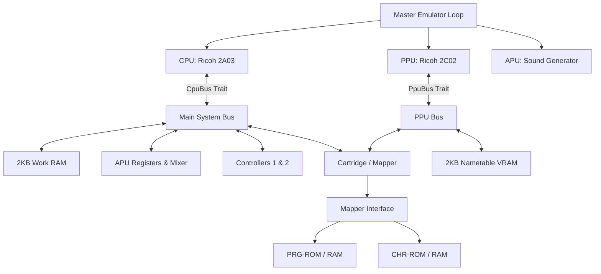

# Famicom (NES) Emulator Design Document: `fce_core`


This document specifies the technical architecture, interface design, timing constraints, WebAssembly (WASM) client-side bindings, online WebRTC P2P Netplay synchronization loops, and dynamic UI State Machine lifecycles for the modular Famicom (NES) emulator.

---

## 1. System Architecture Overview

The emulator is designed around **decoupled components** bound together by interface traits. This avoids Rust's common circular ownership pitfalls and enables **Test-Driven Development (TDD)** by allowing each subsystem to be developed and unit-tested independently with mock implementations.

### Headless & Platform Independence Design Goal
Crucially, the core emulator engine (`fce_core`) has **zero system graphics, audio, or windowing dependencies** (such as SDL2, OpenGL, GLFW, or X11/Wayland). The core acts as a pure data transformer: it consumes CPU/PPU clock cycles and controller button states, and writes raw visual pixels to an active RGBA32 frame buffer and raw audio samples to a queue.

This enables three distinct running modes:
1. **Headless CLI Testing**: Runs ROMs for a preset number of frames in CLI mode and asserts state or compares frame buffer MD5 checksums. This runs out-of-the-box in headless CI systems.
2. **WebAssembly (WASM) Web Client**: The core engine is compiled to WebAssembly (`wasm32-unknown-unknown`) and runs entirely client-side in the browser. JavaScript orchestrates ROM loading, frame ticking (via `requestAnimationFrame`), canvas rendering, and audio playback via the Web Audio API.
3. **P2P Netplay Co-op Mode**: Exposes standard WASM bindings to support direct online 1v1 play sessions over browser WebRTC.

### Component Diagram



### Timing and Synchronization
The NES system is driven by a Master Clock.
- **NTSC Master Clock**: 21.477272 MHz
- **CPU Clock**: Master Clock / 12 (~1.789773 MHz)
- **PPU Clock**: Master Clock / 4 (~5.369318 MHz)
- **Ratio**: Exactly **3 PPU cycles per 1 CPU cycle** for NTSC.

To maintain precise synchronization while preventing performance loss:
1. The emulator runs in a **PPU-driven / Step-by-Step** manner.
2. The master loop steps the CPU by 1 cycle (or runs one instruction and counts its elapsed cycles), and then steps the PPU by `CPU cycles * 3` cycles.
3. NMI (Non-Maskable Interrupt) is generated by the PPU at the start of the vertical blanking interval (VBlank) and signaled to the CPU.

---

## 2. Memory Maps

### 2.1 CPU Memory Map (16-bit / 64KB Address Space)

| Address Range | Size  | Device | Description |
| :--- | :--- | :--- | :--- |
| `0x0000 - 0x07FF` | 2KB | Work RAM | Internal CPU RAM |
| `0x0800 - 0x1FFF` | 6KB | Mirrors | Mirrors of `0x0000 - 0x07FF` (every 0x0800 bytes) |
| `0x2000 - 0x2007` | 8B | PPU Registers | PPU I/O Ports |
| `0x2008 - 0x3FFF` | ~8KB | Mirrors | Mirrors of `0x2000 - 0x2007` (every 8 bytes) |
| `0x4000 - 0x4015` | 22B | APU & I/O | APU channels, DMA |
| `0x4016` | 1B | Joypad 1 | Controller 1 shift register (strobe & read) |
| `0x4017` | 1B | Joypad 2 / APU | Controller 2 shift register (read) / APU Frame Counter (write) |
| `0x4018 - 0x401F` | 8B | APU & I/O | Normally disabled APU/IO functionality |
| `0x4020 - 0xFFFF` | ~48KB | Cartridge | PRG ROM, PRG RAM, Mapper registers |

### 2.2 PPU Memory Map (14-bit / 16KB Address Space)

| Address Range | Size | Device | Description |
| :--- | :--- | :--- | :--- |
| `0x0000 - 0x0FFF` | 4KB | Pattern Table 0 | CHR ROM/RAM Bank 0 |
| `0x1000 - 0x1FFF` | 4KB | Pattern Table 1 | CHR ROM/RAM Bank 1 |
| `0x2000 - 0x23FF` | 1KB | Nametable 0 | VRAM / Screen Layout A |
| `0x2400 - 0x27FF` | 1KB | Nametable 1 | VRAM / Screen Layout B |
| `0x2800 - 0x2BFF` | 1KB | Nametable 2 | VRAM / Screen Layout C (usually mirrored) |
| `0x2C00 - 0x2FFF` | 1KB | Nametable 3 | VRAM / Screen Layout D (usually mirrored) |
| `0x3000 - 0x3EFF` | ~3.7KB | Mirrors | Mirrors of `0x2000 - 0x2EFF` |
| `0x3F00 - 0x3F1F` | 32B | Palette RAM | Background & Sprite Palettes |
| `0x3F20 - 0x3FFF` | 224B | Mirrors | Mirrors of `0x3F00 - 0x3F1F` |

---

## 3. Core Interface Design (The Rust Traits)

To facilitate unit testing and decoupled development, the core components communicate through traits.

### 3.1 CPU Bus Interface (`CpuBus`)
The `Cpu` struct does not directly own the system bus. Instead, it accepts any type implementing `CpuBus` during execution.

```rust
pub trait CpuBus {
    fn read(&mut self, addr: u16) -> u8;
    fn write(&mut self, addr: u16, val: u8);
    fn poll_nmi(&mut self) -> bool;
    fn poll_irq(&self) -> bool;
    fn clear_nmi(&mut self);
}
```

### 3.2 PPU Bus Interface (`PpuBus`)
The PPU interacts with VRAM, Palettes, and Cartridge CHR memory through `PpuBus`.

```rust
pub trait PpuBus {
    fn read(&mut self, addr: u16) -> u8;
    fn write(&mut self, addr: u16, val: u8);
    fn set_mirroring(&mut self, mode: MirroringMode);
}
```

---

## 4. Detailed Component Specifications

### 4.1 CPU Module (Ricoh 2A03)
The CPU is a modified MOS 6502 with no decimal mode and built-in APU and DMA functionality.

#### Execution State
```rust
pub struct Cpu {
    pub a: u8,       // Accumulator
    pub x: u8,       // Index X
    pub y: u8,       // Index Y
    pub pc: u16,     // Program Counter
    pub sp: u8,      // Stack Pointer
    pub status: u8,  // Status Flags
    pub cycles: u64, // Total cycles
    pub pending_nmi: bool,
    pub pending_irq: bool,
}
```

### 4.2 PPU Module (Ricoh 2C02)
The PPU generates the video output using an internal 256x240 pixel resolution grid, rendering at 60 fps. To correctly implement fine/coarse scrolling during rendering, the PPU implements the `v`, `t`, `x`, `w` register model:

```rust
pub struct Ppu {
    pub v: u16,  // Current VRAM address (15 bits)
    pub t: u16,  // Temporary VRAM address (15 bits)
    pub x: u8,   // Fine X scroll (3 bits)
    pub w: bool, // Write toggle (1 bit)
    pub ctrl: u8,   // PPUCTRL
    pub mask: u8,   // PPUMASK
    pub status: u8, // PPUSTATUS
    pub data_buffer: u8,
    pub oam_addr: u8,
    pub oam_data: [u8; 256],
    pub palette_ram: [u8; 32],
    pub scanline: i16,
    pub cycle: i16,
    pub frame_buffer: Box<[u8; 256 * 240 * 4]>, // RGBA32 Format
}
```

### 4.3 APU Module (Audio Processing Unit & Frame Counter Clock)
The APU synthesizes 5 audio channels: Pulse 1, Pulse 2, Triangle, Noise, and DMC. 
To dynamically clock notes and envelopes:
*   **APU Frame Counter**: Driven by CPU cycles inside `Apu::tick()`.
*   **Quarter Frame (240Hz / ~7,457 CPU cycles)**: Clocks the Triangle linear counter.
*   **Half Frame (120Hz / ~14,914 CPU cycles)**: Clocks `length_counter` decays for the Pulse 1, Pulse 2, Triangle, and Noise channels, automatically silencing note outputs when complete.

---

## 5. WebAssembly (WASM) Client-Side Architecture

The web platform interface compiles to WebAssembly (`wasm32-unknown-unknown`) for zero-cost, static deployment.

### 5.1 Shared Memory Strategy (100% Pure Zero-Copy)
Rather than copying the massive frame buffer between WASM and JS, the JS frontend captures a direct `Uint8ClampedArray` view over the WASM linear memory memory and passes it directly to the browser Canvas context:
```javascript
const framePtr = emulator.frame_buffer_ptr();
const rgbaBuffer = new Uint8ClampedArray(wasm_exports.memory.buffer, framePtr, 256 * 240 * 4);
ctx.putImageData(new ImageData(rgbaBuffer, 256, 240), 0, 0);
```
This reduces Javascript frame visual mapping overhead from ~8ms to **0.1ms**, keeping CPU threads free to execute sound scheduling.

---

## 6. Online WebRTC P2P Netplay Specification

We implement **State-Synchronized Input-Delay P2P Netplay** (GGPO-style Lockstep) to connect two players directly over the internet with a zero active server footprint.

### 6.1 Savestate Serialization (Hot-Joining Sync)
To dynamically sync states upon connection or re-joins, the Host serialized its modular memory variables manually into a compact **`68 KB` binary `Uint8Array`** packet and transmits it to the Guest:
*   **Packed Fields**: CPU registers + master cycles + main memory `mem` (64KB) + Video RAM `vram` (2KB) + sprite memory `oam_data` (256B) + APU audio filter states.
*   **Unpacking Loop**: Guest loads this snapshot directly, instantly aligning its `localFrameIndex` to match the Host's `syncFrameIndex`.

### 6.2 2-Frame Input Delay Queue Loop
Every frame, both browsers capture local inputs, buffer them locally, and transmit them to the peer **for execution exactly 2 frames in the future**:

```
Local Frame: F
  │
  ├── 1. Capture Local Input ──> Store in localInputs[F]
  │
  ├── 2. Look-Ahead Transmit ──> Send { frame: F + 2, input: localInput } to Peer P2P
  │
  ├── 3. Check Lockstep Gate: Is opponent's input peerInputs[F] received?
  │        │
  │        ├── [YES] ──> Step WASM emulator using:
  │        │               * Controller 1: localInputs[F - 2] (delayed)
  │        │               * Controller 2: peerInputs[F]      (delayed)
  │        │             localFrameIndex++ (Next Frame)
  │        │
  │        └── [NO]  ──> Block Emulation ──> Render translucent "Buffering..." spinner.
```
*   **Look-Ahead Buffer**: Delaying local inputs by 2 frames (`33ms`) allows opponent input packets to arrive before the frame ticks, rendering gameplay 100% lag-free.
*   **Bootstrap check**: Bypasses the lockstep gate during the first 2 steps immediately following synchronization:
    `const isInitialFrame = (currentFrame - syncFrameIndex) < 2;`

---

## 7. UI/UX Multiplayer State Machine Specification

The connection control panel utilizes a strict, mutually exclusive state machine to prevent visual state corruption.

```
                     ┌───────────────┐
                     │    1. IDLE    │
                     └───────┬───────┘
                 Host Game   │   Join Host
             ┌───────────────┴───────────────┐
             ▼                               ▼
     ┌───────────────┐               ┌───────────────┐
     │  2. HOSTING   │               │ 4. CONNECTING │
     └───────┬───────┘               └───────┬───────┘
       Join  │                               │ Connected
     ┌───────┴───────┐                       │
     ▼               │                       ▼
┌───────────────┐    │               ┌───────────────┐
│ 3. HOST-CONN  │    │               │ 5. GUEST-CONN │
└───────────────┘    │               └───────────────┘
                     │ Stop Hosting
                     └───────────────> Revert to IDLE
```

### 7.1 State Transitions & Interface Behaviors

| State | Trigger Event | Host Button Style/Status | Input Field | Join/Action Button Style/Status | Status Text |
| :--- | :--- | :--- | :--- | :--- | :--- |
| **1. IDLE** | Page Load / Revert | Enabled ("Host Game") | Editable, empty | Enabled ("Join") | "Disconnected" (Gray) |
| **2. HOSTING** | Host clicks "Host Game" | **Enabled ("Stop Hosting")**, Soft Red background | **Locked (readOnly = true)**, contains Host Peer ID | **Enabled ("Copy")** | "Hosting. ID: <id>" (Orange) |
| **3. HOST-CONN** | Guest connects | **Disabled ("Hosting")**, Grayed out | **Locked (readOnly = true)** | **Enabled ("Disconnect")** | "Connected to Player 2!" (Green) |
| **4. CONNECTING** | Guest clicks "Join" | **Disabled ("Host Game")**, Grayed out | **Locked (readOnly = true)** | **Disabled ("Connecting...")**, locks interactions | "Connecting..." (Yellow) |
| **5. GUEST-CONN** | Connection established | **Disabled ("Host Game")**, Grayed out | **Locked (readOnly = true)** | **Enabled ("Disconnect")** | "Connected to Player 1 (Host)!" (Green) |

### 7.2 Teardown and ROM-Swap Safety
*   **Host Session Persistence**: If a Guest disconnects, the Host remains actively hosting on their Peer ID (reverting to `State 2: Hosting`), allowing instant reconnects without exchanging new IDs.
*   **Guest Emulator Reset**: When a Guest leaves, the Guest's UI reverts back to `Idle` and their emulator core **automatically reloads the default ROM**, resetting CPU, VRAM, and audio to a clean starting title screen.
*   **ROM-Swap Safety**: Dragging a new ROM file while connected instantly terminates the WebRTC connection to prevent cross-game memory corruption.
