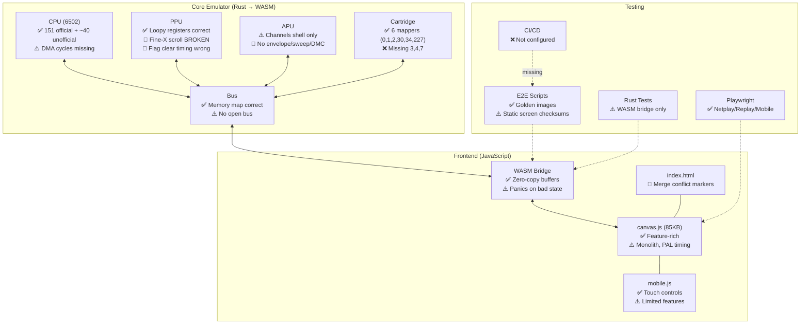

# FcEmu — NES Emulator Comprehensive Review Report

> **Date**: 2026-05-28  
> **Scope**: Requirements, Design, Implementation (CPU/PPU/APU/Cartridge/WASM/Frontend), Testing  
> **Method**: Line-by-line source code review by 5 parallel research agents  
> **Verdict**: Solid CPU foundation, but critical PPU rendering bugs and missing APU features significantly limit accuracy.

---

## Executive Summary

FcEmu is a Rust-based NES emulator compiled to WebAssembly for browser-based play. The project has **impressive breadth** — specifying netplay, replay recording, mobile support, and comprehensive testing. After reviewing every source file, the findings are:

- **~55 technical issues** across accuracy, correctness, architecture, and documentation
- **A significant gap** between documentation claims and implementation reality
- **Critical PPU bug**: Fine X scrolling is fundamentally broken — will affect nearly all scrolling games
- **Critical APU gaps**: Envelope, sweep, and DMC are missing or stub — audio is severely degraded
- **Git merge conflict markers** left in production `index.html`

| Area | Grade | Summary |
|------|-------|---------|
| Requirements & Design | **B** | Thorough but stale; mapper lists contradictory across docs, many obsolete plan files |
| CPU (6502) | **A-** | All official + many unofficial opcodes; DMA cycle accounting is the main gap |
| PPU | **C+** | Loopy registers correct, but fine-X scroll is broken; sprite overflow missing |
| APU | **D+** | Channel shells exist but envelope, sweep, and DMC are missing/stubbed |
| Cartridge/Mappers | **B** | 6 mappers with clean design; missing MMC3, CNROM, AxROM |
| WASM Bridge | **B+** | Clean API with good save state support; panics on malformed data |
| Frontend (Web) | **B-** | Feature-rich but has merge conflict markers; monolithic JS; PAL timing wrong |
| Testing | **B-** | Good multi-layer test pyramid; golden checksums need work; no CI pipeline |

---

## 1. Requirements & Design Documents

### 1.1 Document Inventory

| Document | Purpose | Size | Status |
|----------|---------|------|--------|
| [ORIGINAL_REQUEST.md](file://ORIGINAL_REQUEST.md) | Chronological user requests (10 follow-ups) | 32 KB | Active |
| [DESIGN.md](file://DESIGN.md) | V3.0 master design spec | 66 KB | **Truncated** at lines ~1154, ~1336 |
| [TODO.md](file://TODO.md) | Phase-based task tracker (302 lines) | 18 KB | **All checkboxes unchecked** |
| [README.md](file://README.md) | Public-facing project description | 6 KB | Missing netplay/PAL mentions |
| [RELEASE.md](file://RELEASE.md) | Build & deployment guide | 5 KB | No test steps |
| [BRIEFING.md](file://BRIEFING.md) | AI agent coordination artifact | 1.4 KB | Claims "Victory Confirmed" |
| 6 PLAN docs | Debug/verification plans | 3-6 KB ea. | Mostly obsolete (reference deleted server arch) |

### 1.2 Cross-Document Inconsistencies

| Issue | Documents | Severity |
|-------|-----------|----------|
| **Mapper list mismatch**: ORIGINAL_REQUEST says 0,1,2,3; TODO says 0,1,2,4; DESIGN says 0,2,227; actual code has 0,1,2,30,34,227 | ORIGINAL_REQUEST, TODO, DESIGN, source | 🔴 High |
| **All TODO items unchecked** despite BRIEFING saying "Victory Confirmed" | TODO, BRIEFING | 🔴 High |
| **Missing TODO phases** for WASM migration, Netplay, Mobile, Region, Recording | TODO vs. ORIGINAL_REQUEST, DESIGN | 🟡 Medium |
| **Phase numbering gaps** (13-15 missing) in TODO | TODO, ORIGINAL_REQUEST | 🟡 Medium |
| **DESIGN.md truncated** — content corrupted around sections 11-12 (~line 1154) | DESIGN | 🟡 Medium |
| **DMC channel unspecified** — APU section covers Pulse/Triangle/Noise but not DMC | DESIGN | 🟡 Medium |
| **Obsolete server references** in AUDIO_VISUAL_PLAN, DEBUG_AV_PLAN, DEBUG_PLAY_PLAN, PERFORMANCE_PLAN | Plan docs | 🟡 Medium |
| **CPU module path** inconsistency (`src/cpu/` vs `src/core/cpu/`) | TODO | 🟢 Low |
| **README missing** Netplay and NTSC/PAL features | README | 🟢 Low |

> [!WARNING]
> The documentation represents at least 3 different architectural eras (headless server → WebSocket streaming → WASM client-side). Several plan documents reference the deleted `web_server.rs` architecture and should be marked obsolete or removed.

---

## 2. CPU Implementation

**Files**: [cpu/mod.rs](file://src/core/cpu/mod.rs) (1625 lines) | [bus.rs](file://src/core/bus.rs) | [region.rs](file://src/core/region.rs)

### 2.1 What's Good ✅
- All **151 official 6502 opcodes** implemented
- **~40 unofficial opcodes** implemented (LAX, SAX, DCP, ISB, SLO, RLA, SRE, RRA, ANC, ALR, ARR, ATX, AXS, SHX, SHY, plus various undocumented NOPs)
- All **11 addressing modes** correct, including JMP indirect page boundary bug
- **Interrupt handling** (NMI, IRQ, BRK, RESET) functionally correct with proper vector addresses
- All **status flag** operations (N, V, B, D, I, Z, C) correctly implemented
- **Page-crossing penalties** correctly applied on read instructions
- **BCD mode** correctly omitted (Ricoh 2A03 disables it)
- Catch-all `_ =>` treats unhandled opcodes as 1-byte 2-cycle NOPs (reasonable fallback)

### 2.2 Issues Found

| # | Severity | Issue | Details |
|---|----------|-------|---------|
| C1 | 🔴 **Critical** | **OAM DMA doesn't stall CPU** | [bus.rs:238-245](file://src/core/bus.rs#L238-L245): DMA copies 256 bytes via `self.read()` (ticking PPU per-byte), but CPU `step()` only returns the STA $4014 cycle cost (~4 cycles). Real DMA takes **513-514 cycles**. Games relying on DMA timing for raster effects will break. |
| C2 | 🟡 Medium | **Interrupt polling at instruction start** | NMI/IRQ polled at the beginning of `step()` before opcode fetch. Real hardware samples during the penultimate cycle of the current instruction. Processes interrupts one instruction too early. |
| C3 | 🟡 Medium | **Store instructions skip dummy read** | `STA abs,X` (0x9D) and `STA abs,Y` (0x99) should perform a dummy read of the uncorrected address. Missing dummy reads can cause PPU/APU side-effect desync. |
| C4 | 🟡 Medium | **Open bus returns 0** | [bus.rs:219](file://src/core/bus.rs#L219): Unmapped addresses ($4018-$401F) return `0` instead of last bus value. Some games rely on open bus behavior. |
| C5 | 🟡 Medium | **`cycles` field dual-use fragility** | `self.cycles` serves as both a running total and a side-channel for `alu_op` to communicate page-crossing penalties. The `extra_cycles` pattern at [lines 1619-1622](file://src/core/cpu/mod.rs#L1619-L1622) works but is fragile. |
| C6 | 🟢 Low | **KIL/JAM opcodes not handled** | Opcodes like $02, $12, $22, etc. that should halt the CPU fall through to catch-all NOP. Acceptable for compatibility. |
| C7 | 🟢 Low | **65KB `mem` array is wasteful** | `SimpleBus` allocates 65,536 bytes but only $0000-$07FF (2KB) is internal RAM. ~63KB wasted. |
| C8 | 🟢 Low | **Controller read hardcodes bit 6** | [bus.rs:192-199](file://src/core/bus.rs#L192-L199): `| 0x40` is a simplification of open bus on upper bits. |

---

## 3. PPU Implementation

**Files**: [ppu/mod.rs](file://src/core/ppu/mod.rs) (215 lines) | [ppu/registers.rs](file://src/core/ppu/registers.rs) (104 lines) | [ppu/render.rs](file://src/core/ppu/render.rs) (264 lines)

### 3.1 What's Good ✅
- **Loopy register implementation** is textbook-correct (v, t, x, w toggle, all five writes)
- **Coarse X/Y increment** with nametable toggle at wrap boundaries ✅
- **Horizontal/Vertical transfer** at correct cycles (257 and 280-304) ✅
- **$2002 PPUSTATUS** read correctly clears VBlank and resets write toggle ✅
- **$2007 read buffer** with immediate palette read and nametable buffer fill ✅
- **Open bus behavior** on register reads is correctly implemented ✅
- **8×16 sprite mode** with correct pattern table selection and flip handling ✅
- **Palette mirroring** ($3F10→$3F00, $3F14→$3F04, etc.) correct ✅

### 3.2 Issues Found

| # | Severity | Issue | Details |
|---|----------|-------|---------|
| P1 | 🔴 **Critical** | **Fine X scrolling is fundamentally broken** | [render.rs:102-111](file://src/core/ppu/render.rs#L102-L111): `render_pixel()` manually checks `(x & 0x07) + self.x >= 8` to decide whether to increment coarse X in a local `v_fetch`. **This double-counts the scroll** — `v` is already being incremented every 8 cycles by the Loopy logic. The `bit_shift` at line 130 compounds the issue by mixing screen pixel `x` with fine-x incorrectly. **Will cause broken scrolling in nearly all scrolling games.** |
| P2 | 🔴 **Critical** | **VBlank/Overflow/Sprite0Hit flags cleared at wrong time** | [render.rs:69-74](file://src/core/ppu/render.rs#L69-L74): Flags cleared when `scanline >= total_scanlines` (scanline wraps from 261→0). Should be at **dot 1 of pre-render scanline (261)**. Off by an entire scanline. |
| P3 | 🔴 **Critical** | **Spurious `v = t` copy at scanline wrap** | [render.rs:76](file://src/core/ppu/render.rs#L76): Does a full `v = t` copy when `scanline >= total_scanlines`. This is incorrect — Y transfer happens at dots 280-304 of pre-render scanline (correctly handled elsewhere), and X transfer at dot 257. This bulk copy corrupts scroll state. |
| P4 | 🔴 High | **Sprite overflow not implemented at all** | The overflow flag (status bit 5) is only cleared, never set. No scanline sprite count evaluation. No hardware bug emulation. Games using overflow for raster effects will malfunction. |
| P5 | 🟡 Medium | **VBlank set at dot 0 instead of dot 1** | [render.rs:62-67](file://src/core/ppu/render.rs#L62-L67): VBlank flag set when scanline counter first reaches 241 (cycle 0). Should be dot 1. |
| P6 | 🟡 Medium | **Missing NMI suppression** | Reading $2002 on the exact cycle VBlank is set should suppress both the flag and NMI. Not handled. Breaks games like Battletoads. |
| P7 | 🟡 Medium | **Missing NMI re-trigger** | Writing to PPUCTRL to enable NMI while VBlank flag is already set should assert NMI. Not checked in `write_ctrl`. |
| P8 | 🟡 Medium | **Missing odd-frame skip** | NTSC odd frames should skip the last dot of pre-render scanline (340 dots instead of 341). Affects frame timing. |
| P9 | 🟡 Medium | **FourScreen mirroring broken** | [bus.rs:56-77](file://src/core/bus.rs#L56-L77): Uses `addr & 0x07FF` with only 2KB VRAM. Four-screen requires 4KB (from cartridge). Silently falls back to vertical mirroring. |
| P10 | 🟡 Medium | **Missing tile prefetch** | Coarse X doesn't increment during cycles 321-336 (tile prefetch for next scanline). Could affect scroll timing at scanline boundaries. |
| P11 | 🟡 Medium | **Grayscale mode not implemented** | PPUMASK bit 0 should AND all palette values with $30. |
| P12 | 🟡 Medium | **Color emphasis not implemented** | PPUMASK bits 5-7 for color emphasis/tinting not handled. |
| P13 | 🟡 Medium | **Per-pixel sprite evaluation is O(3.9M)** | Scans all 64 sprites on every pixel (64×256×240). Should evaluate per-scanline as hardware does. Functionally correct but very slow. |
| P14 | 🟢 Low | **OAMDATA read during rendering** should return 0xFF | Not implemented. |
| P15 | 🟢 Low | **OAMDATA attribute byte bits 2-4** should read as 0 | Not masked. |

> [!CAUTION]
> Issue **P1 (broken fine-X scroll)** is the single most impactful rendering bug. The `render_pixel()` function's manual tile-boundary crossing logic conflicts with the Loopy coarse-X increments. Almost every game with horizontal scrolling (Super Mario Bros., Mega Man, Castlevania, etc.) will display incorrectly.

---

## 4. APU Implementation

**File**: [apu/mod.rs](file://src/core/apu/mod.rs) (601 lines)

> [!IMPORTANT]
> The APU is implemented as a single 601-line file with all channels inline. There are no separate module files for pulse, triangle, noise, or DMC — they are all structs within `mod.rs`.

### 4.1 What's Good ✅
- **Pulse channels**: Duty cycle selection (4 sequences), timer, length counter ✅
- **Triangle channel**: Timer, step sequencer (0-31), linear counter, ultrasonic silencing ✅
- **Noise channel**: 15-bit LFSR with correct taps, short/long mode, period table ✅
- **Frame counter**: 4-step and 5-step modes, write delay (3-4 cycles) ✅
- **Non-linear mixing** uses correct NES lookup formula: `95.88 / (8128/(p1+p2) + 100)` and `159.79 / (1/(tri/8227 + noise/12241) + 100)` ✅
- **Audio filtering**: High-pass (~90 Hz, α=0.996) and low-pass (~14 kHz, α=0.666) ✅
- **44100 Hz downsampling** with cycle accumulation ✅

### 4.2 Issues Found

| # | Severity | Issue | Details |
|---|----------|-------|---------|
| A1 | 🔴 **Critical** | **Envelope unit completely missing** | Pulse and noise channels have `constant_volume` and `volume` fields, but there is **no envelope counter logic** anywhere. When `constant_volume` is false, the NES uses a decaying envelope. Currently always uses raw volume value. All sounds are flat — no volume decay on explosions, impacts, etc. |
| A2 | 🔴 **Critical** | **Sweep unit completely missing** | [mod.rs:427,447](file://src/core/apu/mod.rs#L427): Registers $4001 and $4005 are **stubbed** (`0x4001 => {}`). No sweep period adjustment, no mute condition. Mario coin sound, 1-Up sound, and many pitch effects are wrong. |
| A3 | 🔴 **Critical** | **DMC produces no audio** | DMC channel tracks bytes_remaining and active state, but **never reads sample bytes from memory, never maintains an output level, and is not included in the mixer**. The `mix()` function takes only pulse1/pulse2/triangle/noise — no DMC. |
| A4 | 🔴 **Critical** | **$4011 (DMC direct load) unhandled** | No match arm for $4011 in `write_reg()`. Games using direct PCM output (Blaster Master, Battletoads intro voices) produce silence. |
| A5 | 🔴 High | **$4012 (DMC sample address) stubbed** | [mod.rs:504](file://src/core/apu/mod.rs#L504): `0x4012 => {}` — should compute `0xC000 + (val * 64)`. |
| A6 | 🟡 Medium | **5-step frame counter bug** | [mod.rs:329-332](file://src/core/apu/mod.rs#L329-L332): Step 4→0 transition incorrectly clocks both quarter and half frame. Step 4 should be the empty step where nothing happens. |
| A7 | 🟡 Medium | **Triangle linear counter reload flag** conflated with control flag | [mod.rs:256-260](file://src/core/apu/mod.rs#L256-L260): No separate reload flag tracked. When `control_flag` is false, one reload-then-clear cycle is lost. |
| A8 | 🟡 Medium | **Pulse/noise may tick at wrong rate** | All channels tick through `tick(1)` at what appears to be CPU rate. Pulse and noise should tick at **half CPU rate** (APU runs at CPU/2). Triangle correctly ticks at CPU rate. |
| A9 | 🟡 Medium | **DMC missing from TND mix** | Even if DMC produced output, the mixing formula's `tnd_sum` doesn't include `dmc / 22638.0`. |
| A10 | 🟢 Low | **IRQ handling** appears correct for frame counter mode. |

> [!CAUTION]
> The APU issues (A1-A4) make audio output significantly worse than it should be. **Envelopes** affect every sound effect in every game. **Sweep** affects iconic NES sounds. **DMC** affects any game with sampled audio. Together, these make the emulator's audio unrecognizable compared to real hardware.

---

## 5. Cartridge & Mapper Implementation

**Files**: [cartridge/mod.rs](file://src/core/cartridge/mod.rs) (282 lines) | [cartridge/mapper.rs](file://src/core/cartridge/mapper.rs) (916 lines)

### 5.1 Supported Mappers

| Mapper | Name | Status | Notes |
|--------|------|--------|-------|
| 0 | NROM | ✅ Complete | 16KB mirroring, 32KB direct, PRG RAM |
| 1 | MMC1 (SxROM) | ✅ Complete | Shift register, 4 PRG modes, 2 CHR modes, dynamic mirroring, banked PRG RAM |
| 2 | UxROM | ✅ Complete | Switchable 16KB + fixed last bank |
| 30 | UNROM 512 | ⚠️ Bug | CHR bank bit extraction wrong |
| 34 | BNROM/NINA-001 | ✅ Complete | Auto-detects variant via CHR bank count |
| 227 | Multicart | ✅ Complete | NROM-128/256/UNROM modes, comprehensive tests |

### 5.2 Issues Found

| # | Severity | Issue | Details |
|---|----------|-------|---------|
| M1 | 🔴 High | **Missing Mapper 3 (CNROM)** | One of the simplest and most common mappers. Very easy to add. |
| M2 | 🔴 High | **Missing Mapper 4 (MMC3)** | Used by a huge number of games (SMB3, Mega Man 3-6, Kirby). This is the most impactful missing mapper. |
| M3 | 🔴 High | **Missing Mapper 7 (AxROM)** | Used by many games (Battletoads, Marble Madness). Simple to implement. |
| M4 | 🟡 Medium | **Mapper 30 CHR bank bit extraction bug** | [mapper.rs:746](file://src/core/cartridge/mapper.rs#L746): `(val >> 7) & 0x03` extracts bits 7-8, but u8 only has bits 0-7. Should be `(val >> 5) & 0x03` to extract bits 5-6. Only 2 of 4 CHR banks can be selected. |
| M5 | 🟡 Medium | **No SRAM persistence** | `has_battery` flag is parsed but PRG RAM is never saved to storage. Battery-backed saves (Zelda, Final Fantasy) lost on page reload. |
| M6 | 🟢 Low | **MMC1 consecutive write filtering** not implemented | Real hardware ignores writes on consecutive CPU cycles. |
| M7 | 🟢 Low | **No "DiskDude!" header corruption detection** | Bytes 7-15 in bad ROM dumps can corrupt mapper ID. |
| M8 | 🟢 Low | **NES 2.0 extended fields** not parsed | Only region byte extracted from NES 2.0 headers. |

### 5.3 Mapper Coverage Impact

```
Current (6 mappers):  ~65-70% of NES library
+ Mapper 3 (CNROM):   ~75%
+ Mapper 4 (MMC3):    ~85%
+ Mapper 7 (AxROM):   ~88%
+ Mapper 9 (MMC2):    ~90%
```

---

## 6. WASM Bridge

**File**: [wasm.rs](file://src/core/wasm.rs) (21.5 KB)

### 6.1 What's Good ✅
- Clean API: `load_rom`, `step_frame`, `write_controller`, `save_state`, `load_state`, SRAM management
- Zero-copy frame buffer (`*const u8` for 256×240×4 RGBA) and audio buffer (`*const f32`)
- Region support (NTSC/PAL) with auto-detection and manual override
- Unit tests for SRAM, controller 2, save/load state

### 6.2 Issues Found

| # | Severity | Issue | Details |
|---|----------|-------|---------|
| W1 | 🔴 High | **`unwrap()` panics crash WASM** | [wasm.rs:271-344](file://src/core/wasm.rs#L271-L344): `load_state()` uses `.unwrap()` on `try_into()` calls. Malformed state data passes minimum length check but panics on invalid sub-slices, crashing the entire emulator. Should return `false`. |
| W2 | 🟡 Medium | **No save state versioning** | No magic bytes or version header. Format changes silently corrupt emulator state. |
| W3 | 🟡 Medium | **`load_rom` swallows errors** | [wasm.rs:39](file://src/core/wasm.rs#L39): `Err(_)` discards the actual error message. JS gets `false` with no diagnostics. |
| W4 | 🟢 Low | **`get_sram()` clones on every call** | [wasm.rs:140](file://src/core/wasm.rs#L140): Clones entire PRG RAM Vec. Called every 5 seconds by auto-save timer (~16KB alloc+free). |
| W5 | 🟢 Low | **`set_region` silently defaults** | Invalid region values default to NTSC with no warning. |

---

## 7. Web Frontend

**Files**: [index.html](file://static/index.html) (37 KB) | [canvas.js](file://static/canvas.js) (85 KB) | [mobile.html](file://static/mobile.html) | [mobile.js](file://static/mobile.js)

### 7.1 Issues Found

| # | Severity | Issue | Details |
|---|----------|-------|---------|
| F1 | 🔴 **Critical** | **Git merge conflict markers in production HTML** | [index.html:299-300](file://static/index.html#L299-L300): `<<<<<<< HEAD` appears **twice** inside a `<style>` block. Malformed CSS. |
| F2 | 🟡 High | **PAL games run 20% too fast** | Frame loop uses `requestAnimationFrame` (60 Hz). PAL NES runs at 50 Hz. No frame timing compensation. |
| F3 | 🟡 High | **PeerJS version mismatch** | CDN loads 1.5.2, `package.json` has ^1.5.4. |
| F4 | 🟡 High | **HANDSHAKE silently dropped** | [canvas.js:1661](file://static/canvas.js#L1661): Sent as JSON object, but data handler decodes everything as binary `ArrayBuffer`. HANDSHAKE fails `decodePacket()` silently. |
| F5 | 🟡 Medium | **Duplicate `controllerState`** | `window.controllerState = 0` (line 79) AND `let controllerState = 0` (line 621). Keyboard and gamepad use different variables, OR'd together on line 794. Confusing and error-prone. |
| F6 | 🟡 Medium | **No CDN integrity hashes** | PeerJS and JSZip loaded from CDN without `integrity` attributes (SRI). |
| F7 | 🟡 Medium | **Recording uses slow btoa() loop** | [canvas.js:2174](file://static/canvas.js#L2174): Character-by-character base64 encoding of ~68KB save state. Should use `Uint8Array` directly. |
| F8 | 🟡 Medium | **No tab visibility pausing** | When backgrounded, rAF throttles to 1 FPS but audio buffers keep accumulating. Wastes battery on mobile. |
| F9 | 🟢 Low | **Mobile missing features** | No save states, no ROM upload, no netplay on mobile. |
| F10 | 🟢 Low | **No ROM size validation** in JS | Arbitrary user bytes passed to Rust parser. No JS-side size limit. |

---

## 8. Testing Infrastructure

### 8.1 Test Layers

| Layer | Tool | Status |
|-------|------|--------|
| Rust unit tests | `cargo test` | ✅ Some WASM bridge tests, bus tests |
| Blargg test ROMs | `headless --test` | ⚠️ `branch_timing.nes` skipped |
| Golden image checksums | Python harnesses | ⚠️ Squirrel checksums all identical (static screen) |
| External ROM suite | Process pool | ✅ Parallel execution, known discrepancy list |
| Netplay E2E | Playwright | ✅ Mock + real PeerJS tests |
| Replay E2E | Playwright | ✅ SHA-256 deterministic verification |
| Mobile E2E | Playwright | ✅ Touch event simulation |

### 8.2 Issues Found

| # | Severity | Issue | Details |
|---|----------|-------|---------|
| T1 | 🔴 High | **No CPU/PPU/APU unit tests in Rust** | No `#[test]` functions for opcode behavior, flag handling, rendering, or audio output. A single refactor could silently break core emulation. |
| T2 | 🔴 High | **No CI/CD pipeline** | `.github/` directory exists but no workflow files. Tests never run automatically. |
| T3 | 🟡 Medium | **Golden checksums all identical** | `verify_squirrel.py`: All 4 checkpoints (frames 60, 180, 240, 300) have same MD5. Tests static title screen, not gameplay rendering. |
| T4 | 🟡 Medium | **Audio tests not integrated** | `analyze_audio.py` and `analyze_active_audio.py` exist but aren't called by `run_tests.sh`. |
| T5 | 🟡 Medium | **Playwright tests not in `run_tests.sh`** | Only Rust and Python tests run. No browser E2E in main test script. |
| T6 | 🟡 Medium | **Benchmark runner references deleted binary** | `benchmark_runner.py` references `./target/debug/fce_web_server` which doesn't exist. Dead code. |
| T7 | 🟢 Low | **`image`/`md5` deps compiled into WASM** | Only used by headless binary. Should be behind a feature flag in Cargo.toml. |

---

## 9. Priority Recommendations

### 🔴 Must Fix (Critical — affects basic functionality)

| # | Fix | Impact |
|---|-----|--------|
| 1 | **Fix PPU fine-X scrolling** in `render_pixel()` — remove manual tile-boundary logic, use `self.x` as bit offset into current tile only | Fixes scrolling in ~90% of NES games |
| 2 | **Fix VBlank/flag clear timing** — move from scanline wrap to dot 1 of pre-render scanline | Fixes timing-sensitive games |
| 3 | **Remove spurious `v = t` copy** at scanline wrap | Fixes scroll state corruption |
| 4 | **Implement APU envelope unit** for pulse and noise | Fixes all volume decay sound effects |
| 5 | **Implement APU sweep unit** for pulse channels | Fixes pitch effects (Mario coin, 1-Up) |
| 6 | **Implement DMC audio output** — sample reading, output level, mixer integration | Enables sampled audio in games |
| 7 | **Fix git merge conflict markers** in index.html | Fixes potential CSS rendering issues |
| 8 | **Fix `load_state()` unwrap panics** — return `false` instead of crashing WASM | Prevents emulator crashes |

### 🟡 Should Fix (High — improves accuracy and reliability)

| # | Fix | Impact |
|---|-----|--------|
| 9 | **Add OAM DMA cycle stall** (513-514 CPU cycles) | Fixes timing-sensitive raster effects |
| 10 | **Add Mapper 4 (MMC3)** with A12-based scanline counter | Enables SMB3, Mega Man 3-6, Kirby, etc. |
| 11 | **Add Mapper 3 (CNROM) and Mapper 7 (AxROM)** | Simple additions for ~20% more game coverage |
| 12 | **Implement sprite overflow** with hardware bug emulation | Fixes games using overflow for effects |
| 13 | **Fix Mapper 30 CHR bank bits** (`>> 5` not `>> 7`) | Fixes CHR banking for UNROM 512 games |
| 14 | **Add PAL frame timing compensation** | Fixes PAL games running 20% too fast |
| 15 | **Set up CI/CD** with GitHub Actions | Catches regressions automatically |
| 16 | **Add Rust unit tests** for CPU opcodes and PPU registers | Foundation of correctness |

### 🟢 Nice to Have (Medium — improves quality)

| # | Fix | Impact |
|---|-----|--------|
| 17 | Fix 5-step frame counter step 4→0 bug | Minor APU timing |
| 18 | Add NMI suppression/re-trigger | Fixes edge-case games |
| 19 | Implement SRAM persistence (IndexedDB) | RPG save data survives reload |
| 20 | Add save state versioning | Future-proof save compatibility |
| 21 | Implement grayscale mode and color emphasis | Visual effects in some games |
| 22 | Add odd-frame skip | NTSC timing accuracy |
| 23 | Refactor canvas.js into modules | Maintainability |
| 24 | Clean up obsolete documentation | Developer experience |

---

## 10. Architecture Overview



---

## 11. Conclusion

FcEmu has a **well-architected Rust core** with an excellent CPU implementation and correct Loopy PPU register mechanics. The web frontend is impressively feature-rich with netplay, replay, and mobile support.

However, the project has **three showstopper issues** that must be resolved:

1. **PPU fine-X scrolling is broken** — the rendering logic double-counts scroll increments, causing visual artifacts in nearly every scrolling game
2. **APU is missing critical features** — no envelope (every sound is flat), no sweep (no pitch effects), no DMC output (no sampled audio)
3. **No CI and minimal Rust tests** — correctness cannot be maintained as the codebase evolves

The CPU implementation is the project's strongest component. If the PPU rendering and APU gaps are addressed, the emulator would be capable of running a significant portion of the NES library with good accuracy.

**Overall assessment: Strong foundation, needs significant work on PPU rendering and APU to be a usable emulator.**
